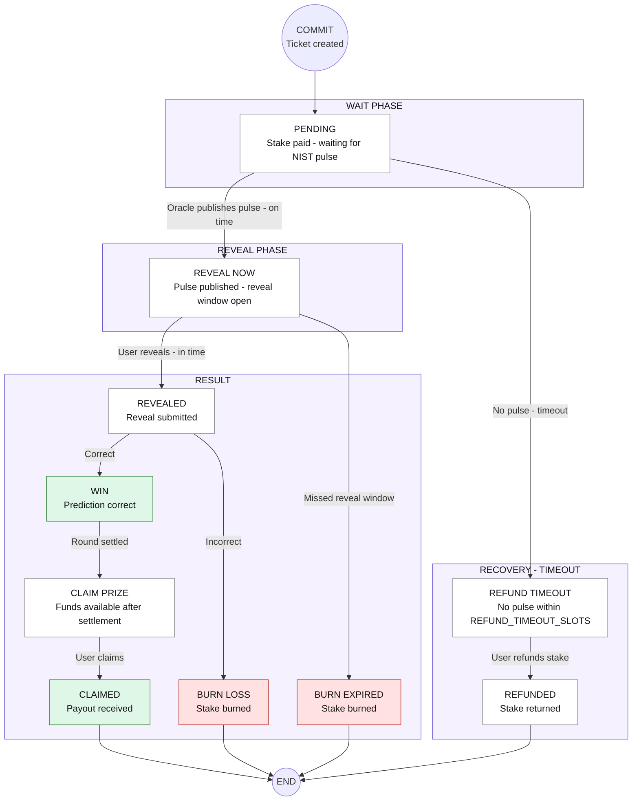
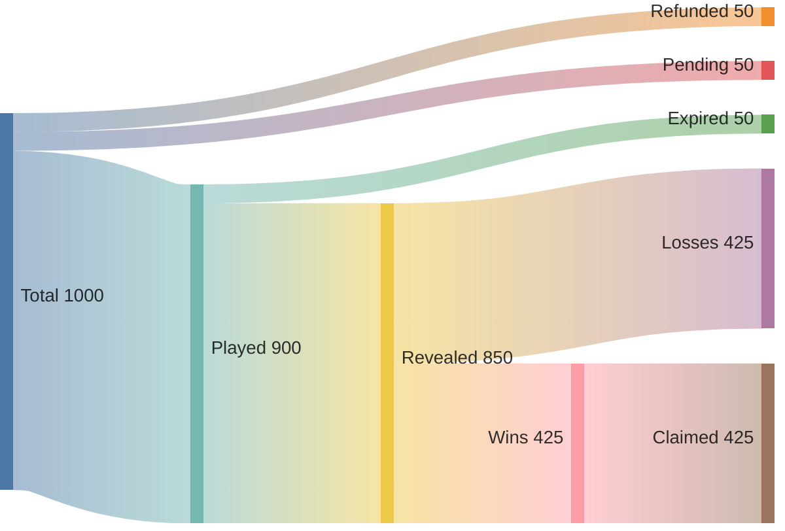

# Ticket Lifecycle in TIMLG

This diagram details all possible ticket states, from the moment a user performs the *commit* to its final resolution.

### Participation Volume Flow

The following Sankey diagram visualizes how tickets typically flow through the system by volume, highlighting the "leakage" point (Expired) and the final distribution of outcomes.

### State Explanations (Updated)

1. **PENDING**: The ticket has been registered on-chain. The user has already paid the *stake*, but the result (NIST Pulse) is not yet available.  
2. **REVEAL NOW**: The pulse is now public on-chain, and the reveal window is still open for the user.  
3. **WIN**: The user revealed and was correct, either waiting for settlement or ready to collect.  
4. **CLAIM PRIZE**: Prize funds are now available for claiming after the round has been settled.  
5. **BURN LOSS**: The user revealed but was not correct. The *stake* is permanently **burned**.  
6. **BURN EXPIRED**: The user **did not reveal on time**. The *stake* is **burned** in the same way as a loss.  
7. **REFUND TIMEOUT**: A safety mechanism activated if the Oracle does not publish the pulse after a reasonable time (`REFUND_TIMEOUT_SLOTS`). Allows the user to recover their *stake*.  
8. **CLAIMED**: Terminal state. The user successfully claimed the prize payout.  
9. **REFUNDED**: Terminal state. The user recovered their *stake* after a timeout (no pulse published).  
