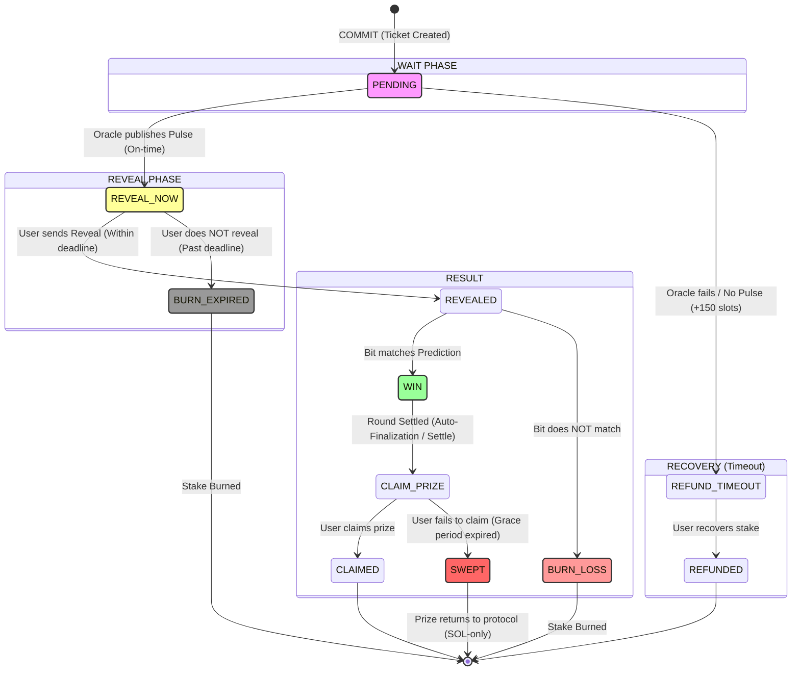

# Ticket Lifecycle in TIMLG

![Lifecycle Diagram](https://mermaid.ink/img/eyJjb2RlIjogInN0YXRlRGlhZ3JhbS12MlxuICAgIFsqXSAtLT4gUEVORElORyA6IENPTU1JVCAoVGlja2V0IENyZWF0ZWQpXG4gICAgXG4gICAgc3RhdGUgXCJXQUlUIFBIQVNFXCIgYXMgV2FpdCB7XG4gICAgICAgIFBFTkRJTkcgLS0-IFJFVkVBTF9OT1cgOiBPcmFjbGUgcHVibGlzaGVzIFB1bHNlIChPbi10aW1lKVxuICAgICAgICBQRU5ESU5HIC0tPiBSRUZVTkRfQUZURVJfVElNRU9VVCA6IE9yYWNsZSBmYWlscyAvIE5vIFB1bHNlICgrMTUwIHNsb3RzKVxuICAgIH1cblxuICAgIHN0YXRlIFwiUkVWRUFMIFBIQVNFXCIgYXMgUmV2ZWFsIHtcbiAgICAgICAgUkVWRUFMX05PVyAtLT4gUkVWRUFMRUQgOiBVc2VyIHNlbmRzIFJldmVhbCAoV2l0aGluIGRlYWRsaW5lKVxuICAgICAgICBSRVZFQUxfTk9XIC0tPiBCVVJOX0VYUElSRUQgOiBVc2VyIGRvZXMgTk9UIHJldmVhbCAoUGFzdCBkZWFkbGluZSlcbiAgICB9XG5cbiAgICBzdGF0ZSBcIlJFU1VMVFwiIGFzIFJlc3VsdCB7XG4gICAgICAgIFJFVkVBTEVEIC0tPiBXSU4gOiBCaXQgbWF0Y2hlcyBQcmVkaWN0aW9uXG4gICAgICAgIFJFVkVBTEVEIC0tPiBCVVJOX0xPU1MgOiBCaXQgZG9lcyBOT1QgbWF0Y2hcbiAgICAgICAgXG4gICAgICAgIFdJTiAtLT4gQ0xBSU1fUFJJWkUgOiBPcGVyYXRvciBzZXR0bGVzIGxhIFJvbmRhIChTbG90IFNldHRsZW1lbnQpXG4gICAgICAgIENMQUlNX1BSSVpFIC0tPiBDTEFJTUVEIDogVXNlciBjbGFpbXMgcHJpemVcbiAgICAgICAgQ0xBSU1fUFJJWkUgLS0-IFNXRVBUIDogVXNlciBmYWlscyB0byBjbGFp0SAoR3JhY2UgcGVyaW9kIGV4cGlyZWQpXG4gICAgfVxuXG4gICAgc3RhdGUgXCJSRUNPVkVSWVwiIGFzIFJlY292ZXJ5IHtcbiAgICAgICAgUkVGVU5EX0FGVEVSX1RJTUVPVVQgLS0-IFJFRlVOREVEIDogVXNlciByZWNvdmVycyBzdGFrZVxuICAgIH1cblxuICAgIEJVUk5fTE9TUyAtLT4gWypdIDogU3Rha2UgQnVybmVkXG4gICAgQ0xBSU1FRCAtLT4gWypdXG4gICAgUkVGVU5ERUQgLS0-IFsqXVxuICAgIEJVUk5fRVhQSVJFRCAtLT4gWypdIDogU3Rha2UgQnVybmVkXG4gICAgU1dFUFQgLS0-IFsqXSA6IFByaXplIHJldHVybnMgdG8gcHJvdG9jb2wgKFNPTC1vbmx5KVxuXG4gICAgJSUtU3R5bGVzXG4gICAgc3R5bGUgUEVORElORyBmaWxsOiNmZjksc3Ryb2tlOiMzMzMsc3Ryb2tlLXdpZHRoOjJweFxuICAgIHN0eWxlIFJFVkVBTF9OT1cgZmlsbDojZmY5LHN0cm9rZTojMzMzLHN0cm9rZS13aWR0aDoycHhcbiAgICBzdHlsZSBXSU4gZmlsbDojOWY5LHN0cm9rZTojMzMzLHN0cm9rZS13aWR0aDoycHhcbiAgICBzdHlsZSBWVVJOX0xPU1MgZmlsbDojZjk5LHN0cm9rZTojMzMzLHN0cm9rZS13aWR0aDoycHhcbiAgICBzdHlsZSBWVVJOX0VYUElSRUQgZmlsbDojOTk5LHN0cm9rZTojMzMzLHN0cm9rZS13aWR0aDoycHhcbiAgICBzdHlsZSBTV0VQUCBmaWxsOiNmNjYsc3Ryb2tlOiMzMzMsc3Ryb2tlLXdpZHRoOjJweCJsLCAibWVybWFpZCI6IHsidGhlbWUiOiAiZGVmYXVsdCJ9fQ)

This diagram details all possible ticket states, from the moment a user performs the *commit* to its final resolution.

### State Explanations (Updated)

1.  **PENDING**: The ticket has been registered on-chain. The user has already paid the *stake*, but the result (NIST Pulse) is not yet available.
2.  **REVEAL NOW**: The pulse is now public on-chain, and the window is still open for the user.
3.  **WIN**: The user revealed and was correct, either waiting for settlement or ready to collect.
4.  **CLAIM PRIZE**: Prize funds are now available for claiming after the round has been settled.
5.  **BURN LOSS**: The user revealed but was not correct. The *stake* is permanently **burned**.
6.  **BURN EXPIRED**: The user **did not reveal on time**. The stake is **burned** in the same way as a loss.
7.  **SWEPT**: The user won but **did not claim** within the grace period. The protocol executes a `sweep` to recover the SOL rent (unclaimed prizes remain in the vault until the round is closed).
8.  **REFUND TIMEOUT**: A safety mechanism activated if the Oracle does not publish the pulse after a reasonable time (`REFUND_TIMEOUT_SLOTS`). Allows the user to recover their *stake*.
9.  **CLAIMED / REFUNDED**: Final receipt of tokens/payout.
