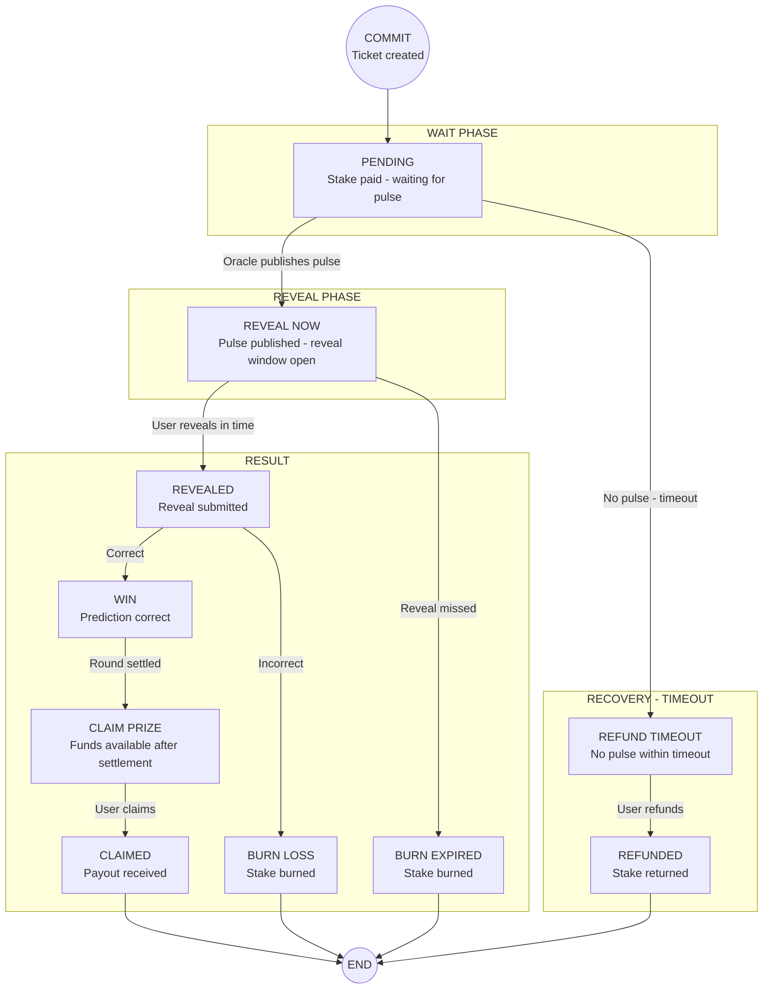

# Ticket Lifecycle

This page summarizes the canonical ticket lifecycle for the current TIMLG MVP.
It is intentionally concise: one visual state map, one transition table, and one note on how wallet statistics relate to the lifecycle.

```mermaid
flowchart 
  Start((COMMIT
Ticket created))

  subgraph WAIT[WAIT PHASE]
    direction TB
    PENDING[PENDING
Stake paid - waiting for pulse]
  end

  subgraph REVEAL[REVEAL PHASE]
    direction TB
    REVEAL_NOW[REVEAL NOW
Pulse published - reveal window open]
  end

  subgraph RESULT[RESULT]
    direction TB
    REVEALED[REVEALED
Reveal submitted]
    WIN[WIN
Prediction correct]
    BURN_LOSS[BURN LOSS
Stake burned]
    CLAIM_PRIZE[CLAIM PRIZE
Funds available after settlement]
    CLAIMED[CLAIMED
Payout received]
    BURN_EXPIRED[BURN EXPIRED
Stake burned]
  end

  subgraph RECOVERY[RECOVERY - TIMEOUT]
    direction TB
    REFUND_TIMEOUT[REFUND TIMEOUT
No pulse within timeout]
    REFUNDED[REFUNDED
Stake returned]
  end

  End((END))

  Start --> PENDING
  PENDING -->|Oracle publishes pulse| REVEAL_NOW
  PENDING -->|No pulse - timeout| REFUND_TIMEOUT
  REVEAL_NOW -->|User reveals in time| REVEALED
  REVEAL_NOW -->|Reveal missed| BURN_EXPIRED
  REVEALED -->|Correct| WIN
  REVEALED -->|Incorrect| BURN_LOSS
  WIN -->|Round settled| CLAIM_PRIZE
  CLAIM_PRIZE -->|User claims| CLAIMED
  REFUND_TIMEOUT -->|User refunds| REFUNDED
  BURN_LOSS --> End
  BURN_EXPIRED --> End
  CLAIMED --> End
  REFUNDED --> End
```

---

## Transition table

| State | Meaning | Next valid transition(s) | Terminal? |
|---|---|---|---|
| **PENDING** | Ticket exists, stake escrowed, pulse not yet set | `REVEAL NOW`, `REFUND TIMEOUT` | No |
| **REVEAL NOW** | Pulse set, reveal window open | `REVEALED`, `BURN EXPIRED` | No |
| **REVEALED** | Reveal accepted, awaiting classification / settlement | `WIN`, `BURN LOSS` | No |
| **WIN** | Ticket classified as winner | `CLAIM PRIZE` | No |
| **CLAIM PRIZE** | Winning ticket is claimable | `CLAIMED` | No |
| **CLAIMED** | Winner claimed | — | Yes |
| **BURN LOSS** | Revealed but incorrect | — | Yes |
| **BURN EXPIRED** | Reveal missed or invalid | — | Yes |
| **REFUND TIMEOUT** | Refund path opened because no pulse was set | `REFUNDED` | No |
| **REFUNDED** | Stake returned | — | Yes |

---

## Economic meaning

| Terminal path | Token consequence |
|---|---|
| **CLAIMED** | Stake refund + reward mint delivered |
| **BURN LOSS** | Escrowed stake burned |
| **BURN EXPIRED** | Escrowed stake burned |
| **REFUNDED** | Original stake returned |

---

## Relation to wallet statistics

| Lifecycle event | `UserStats` significance |
|---|---|
| Commit | Increases participation count |
| Winning reveal | Increases win count and may increase streak |
| Losing reveal | Increases loss count and resets current streak |
| Claim | Increases claimed counter |
| Sweep of unclaimed winner | Increases swept counter |

For the detailed wallet-level counter model, see [User Statistics](protocol/user_stats.md).
