# Round Timeline (Solana Slots)

![Timeline Diagram](https://mermaid.ink/img/eyJjb2RlIjogImdhbnR0XG4gICAgdGl0bGUgUm91bmQgVGltZWxpbmUgK0VqZSBzaG91bGQgYmUgU2xvdHMpXG4gICAgZGF0ZUZvcm1hdCAgWFxuICAgIGF4aXNGb3JtYXQgJXNcblxuICAgIHNlY3Rpb24gVXNlciBQaGFzZXNcbiAgICBDT01NSVQgV2luZG93IChTdGFrZSBFc2Nyb3cpIDogMCwgMTAwMFxuICAgIFJFVkVBTCBXaW5kb3cgKFJldmVhbCBHdWVzcykgOiAxMjAwLCAyMjAwXG5cbiAgICBzZWN0aW9uIFByb3RvY29sIEV2ZW50c1xuICAgIFJvdW5kIENyZWF0aW9uIChTbG90IE4pIDogbWlsZXN0b25lLCAwLCAwXG4gICAgQ09NTUlUIERFQURMSU5FIChDbG9zZSkgOiBtaWxlc3RvbmUsIDEwMDAsIDBcbiAgICBXYWl0IGZvciBOSVNUIFB1bHNlIDogMTAwMCwgMTIwMFxuICAgIFJFVkVBTCBTVEFSVCAoT3JhY2xlIHNpZ25zIHB1bHNlKSA6IG1pbGVzdG9uZSwgMTIwMCwgMFxuICAgIFJFVkVBTCBERUFETElORSAoQ2xvc2UpIDogbWlsZXN0b25lLCAyMjAwLCAwXG4gICAgU0VUVExFTUVOVCAoUHJpemUgQ2FsY3VsYXRpb24pIDogbWlsZXN0b25lLCAyMzAwLCAwXG5cbiAgICBzZWN0aW9uIFBvc3QtUm91bmRcbiAgICBHcmFjZSBQZXJpb2QgZm9yIENsYWltcyA6IDIzMDAsIDMzMDBcbiAgICBTV0VFUCAoQWRtaW4gcmVjb3ZlcnMgdW5jbGFpbWVkKSA6IG1pbGVzdG9uZSwgMzMzMCwgMFxuICAgIFJFRlVOREBTQUZFVFkgKE9ubHkgaWYgT3JhY2xlIGZhaWxzKSA6IDIzNTAsIDQwMDAiLCAibWVybWFpZCI6IHsidGhlbWUiOiAiZGVmYXVsdCJ9fQ)

This diagram represents the temporal progression of a typical TIMLG round, projected onto the Solana slot axis.

```mermaid
gantt
    title Round Timeline (X-Axis = Slots)
    dateFormat  X
    axisFormat %s

    section PHASE 1: BETTING
    COMMIT Window (Stake Escrow) : commit, 0, 1000
    COMMIT DEADLINE (Close) : milestone, 1000, 0

    section PHASE 2: ORACLE
    Security Gap (20s pre-pulse) : gap, after commit, 50s
    Wait for NIST Pulse : pulse_wait, after gap, 60s
    PULSE RECEIVED (Reveal Start) : milestone, after pulse_wait, 0

    section PHASE 3: REVEAL
    REVEAL Window (Users Reveal) : reveal, after pulse_wait, 1000s
    REVEAL DEADLINE (Deadline) : milestone, after reveal, 0

    section PHASE 4: SETTLEMENT
    SETTLEMENT (Settlement / Auto-Finalize) : settle, after reveal, 100s
    Grace Period (Claim) : claim, after settle, 1000s
    
    section PHASE 5: SECURITY
    SWEEP (SOL Rent Sweep) : sweep, after claim, 0
    REFUND TIMEOUT (Only if Oracle fails) : refund, after reveal, 150s
```

### Typical Milestones and Durations (Devnet)

| Phase | Estimated Duration (Slots) | Trigger Event |
| :--- | :--- | :--- |
| **Commit Window** | ~1,000 slots (~6-7 min) | `create_round_auto` |
| **Pulse Lag** | Variable (NIST Sync) | NIST Beacon 2.0 Publication |
| **Reveal Window** | ~1,000 slots (~6-7 min) | `set_pulse_signed` |
| **Grace Period** | ~1,000 - 5,000 slots | `claim_grace_slots` |
| **Refund Safety** | 150 slots after Reveal DL | Oracle Inactivity |

> [!NOTE]
> On Solana Devnet, a block (slot) occurs approximately every **400ms - 500ms**. Therefore, 1,000 slots equal roughly 6.5 minutes in real time.
