# TIMLG Protocol — Devnet Beta User Guide

Welcome to the **TIMLG Protocol Devnet Beta**. This guide walks you through the full lifecycle of a round—from connecting your wallet to claiming rewards—and explains how to read **Order History statuses** and the **Flow Analysis** (Sankey) to audit your results.

!!! info "Test Environment (Devnet)"
    You are on **Solana Devnet**. All SOL and TIMLG tokens used here have **no economic value**. This environment exists to test UX, protocol stability, and round lifecycle integrity.

---

## 1. Getting Started

### 1.1 Configure Phantom for Devnet
Before connecting, ensure your Phantom wallet is set to **Testnet mode**. This allows you to interact with the Solana Devnet.

| 1. Activate Testnet Mode | 2. Devnet View Active |
|:---:|:---:|
| 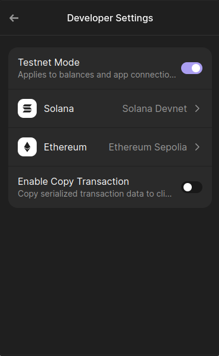 | 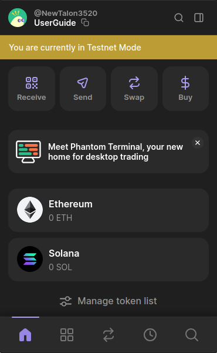 |

---

### 1.2 Connect your wallet
Use the **Connect Wallet** button in the header. If you haven't connected before, the UI will reflect the disconnected state.

---

### 1.3 Get Devnet funds (Faucet)
New wallets will show empty balances. You need a small amount of **SOL** for **transaction fees** to interact with the protocol on Devnet. You also need **TIMLG** to play.

> [!NOTE]
> **Planned:** the protocol is intended to support a **relayer** in the future so users can participate **cost-free** (fees sponsored by the relayer).

Use the Faucet actions to fund your wallet. After a few seconds, your balances will update.

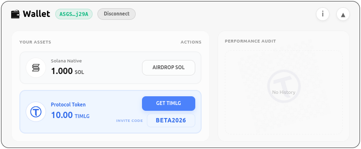

---

## 2. Play a Round (The Play Card)

The **Play Card** is your main interface for analyzing the timeline and submitting predictions. It is divided into four key sections:

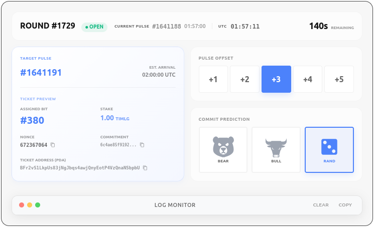

### 2.1 Interface Breakdown

#### A. Top Bar (Round & Timing)
- **Round ID**: The active round identifier (e.g., `ROUND #1729`).
- **Status**: Visual indicator showing if the commitment window is **OPEN**.
- **Current Pulse**: The latest 512-bit randomness pulse published on-chain.
- **Timer**: Real-time countdown to the end of the commitment phase.  
  *(For technical details on phase durations and slot-bound rules, see the [Timing Windows](protocol/timing_windows.md) specification).*

---

#### B. Left Panel (Ticket Details)
- **Target Pulse**: The specific pulse height this ticket is targeting.
- **Assigned Bit**: Your unique bit index within the 512-bit pulse result.
- **Stake**: Amount of **TIMLG** tokens required for this prediction.
- **Technical Stats**:
    - **Nonce**: Security salt for your prediction hash.
    - **Commitment**: The on-chain SHA-256 hash of your hidden guess.
    - **Ticket Address (PDA)**: The unique on-chain account address for this ticket.

---

#### C. Right Panel (Controls & Actions)
- **Pulse Offset**: Buttons to select *which* future round to target (**+1** to **+5**).
- **Commit Buttons**: Your tactical action center.
    - **BEAR**: Predicts a **0** (down).
    - **BULL**: Predicts a **1** (up).
    - **RAND**: Auto-generates a prediction for you.

---

#### D. Bottom Bar (Transaction Log)
- **Log Monitor**: A live console showing your protocol interactions in real-time.

---

## 3. Order History: Following the Lifecycle

Once you commit tickets, they appear in your **Order History**. Here is how a round evolves:

### Step 1: Tickets Committed
In this example, we have committed **7 tickets** to the round. They are currently in the **PENDING** state.

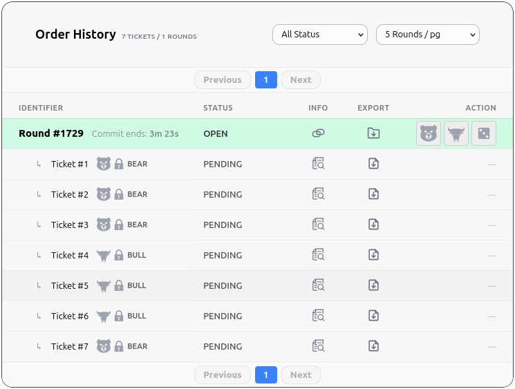

---

### Step 2: Waiting for Pulse
Once the commit window closes, the status changes to **WAITING PULSE**. The protocol is waiting for the Oracle to publish the result.

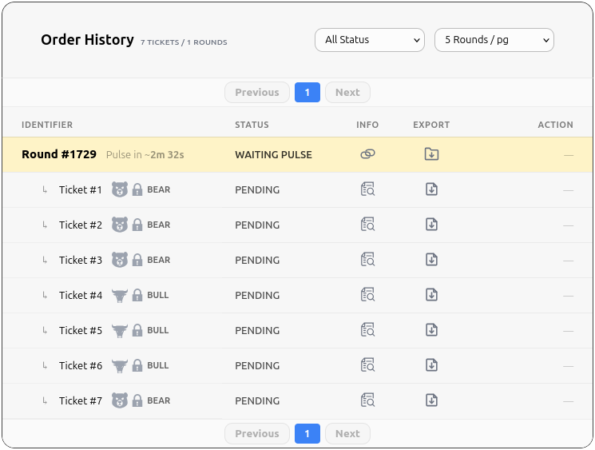

---

### Step 3: Reveal Window Opens
When the pulse is published, the **REVEAL WINDOW** opens. You must reveal your tickets to prove your predictions.

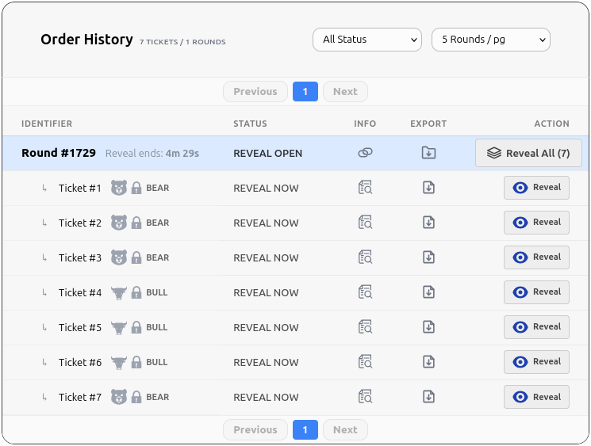

---

### Step 4: Outcomes Revealed
After revealing, you can see which tickets won and which lost.
*   **Winners**: Matched the pulse.
*   **Loss**: Did not match.
*   **Unrevealed**: If you don't reveal in time, the ticket will expire.

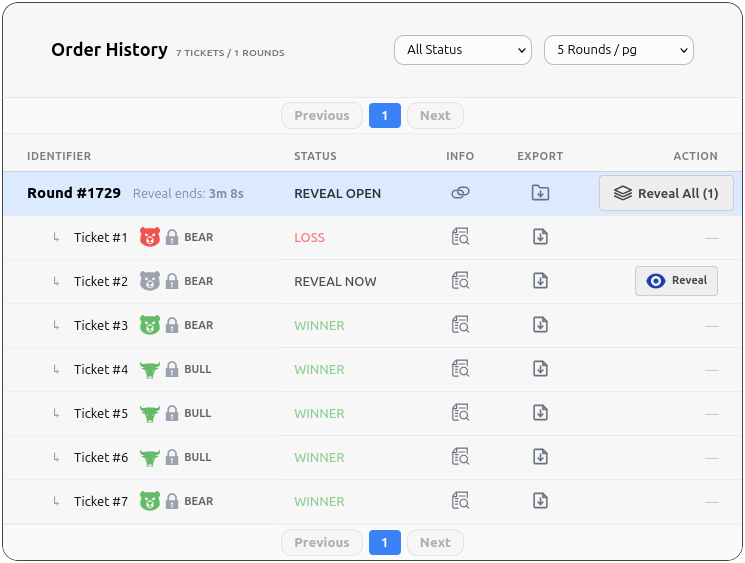

---

### Step 5: Awaiting Settlement
After the reveal window closes, the protocol processes the results.

---

### Step 6: Claiming Prizes
Once settled, winning tickets move to the **CLAIM WINDOW**. You can now claim your winnings.

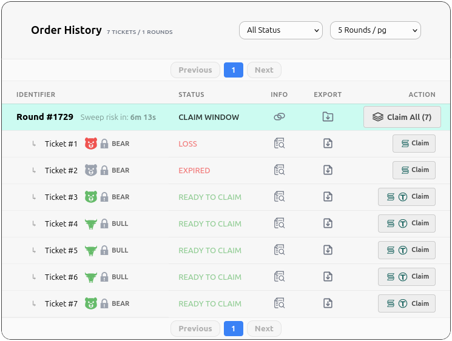

---

### Step 7: Finalizing Claims
As you claim, the tickets are marked as **CLAIMED**. Any ticket not claimed before the round is swept will be lost.

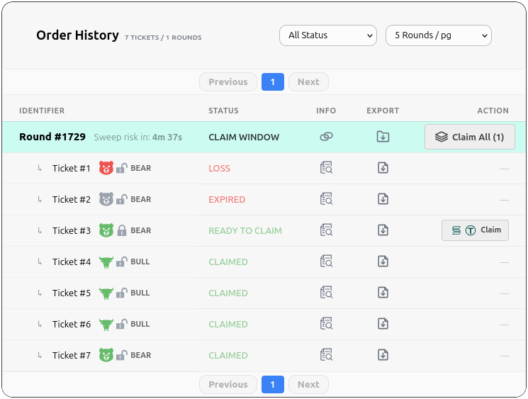

---

### Step 8: Swept Round
If a winner fails to claim their prize within the required timeframe, the funds are **SWEPT** to the protocol treasury.

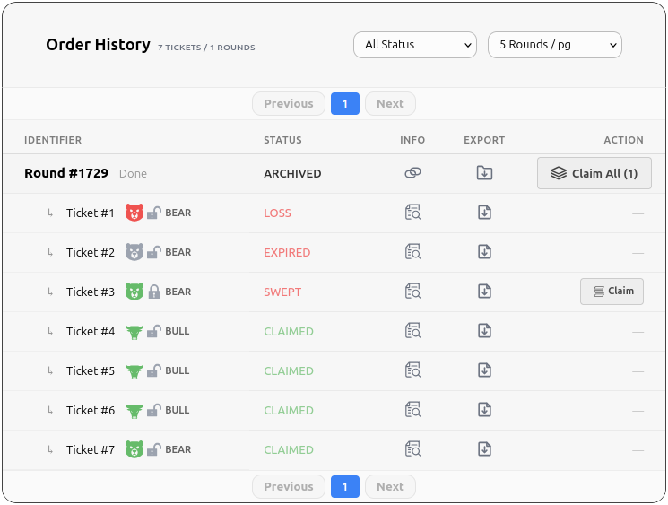

---

## 4. Safety: Refund Mode (Escape Hatch)

If the oracle fails to provide a pulse, the protocol enters **REFUND MODE**. This allows you to recover your stake.

### 4.1 Waiting for Refund Window
The protocol ensures a safe window for all users to request refunds.

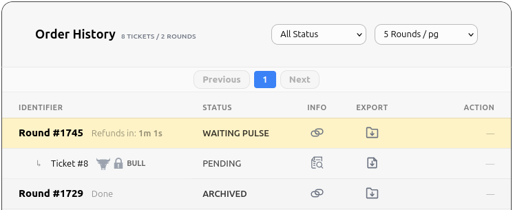

### 4.2 Claiming Refund
Once the window is ready, you can withdraw your original stake.

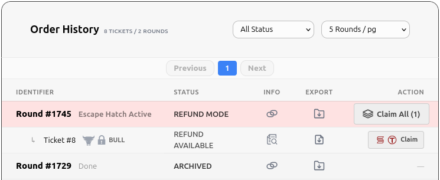

---

## 5. Analytics & Verification

### 5.1 Final Order History
View your completed rounds in the archives to see the final tally of your performance.

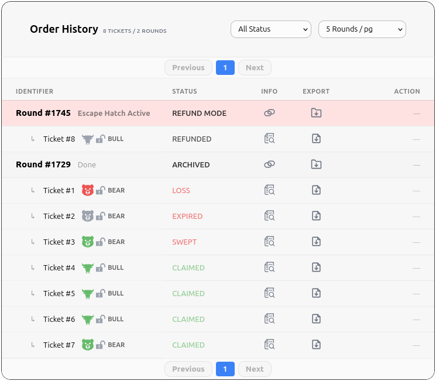

### 5.2 Flow Analysis (Sankey)
The **Flow Analysis** chart provides a visual breakdown of your ticket lifecycle—from played to claimed, lost, or swept.

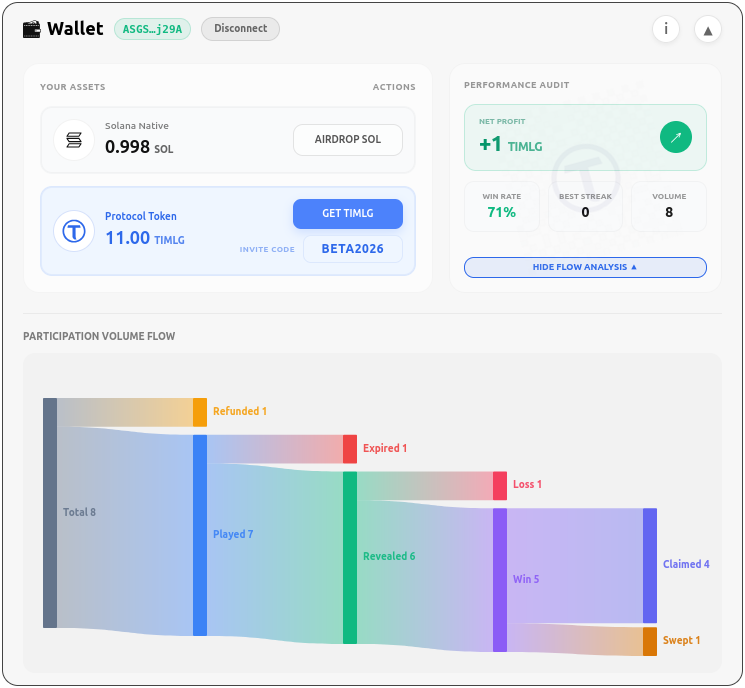

---

## 6. Status Glossary

- **OPEN**: Commit window is active.
- **PENDING**: Prediction recorded, waiting for pulse.
- **WAITING PULSE**: Oracle is generating the result.
- **REVEAL OPEN**: You can now reveal your prediction.
- **WIN / LOSS**: Final outcome of a revealed ticket.
- **CLAIM WINDOW**: Winners can collect prizes.
- **SWEPT**: Prize was not claimed in time.
- **REFUND MODE**: Safety protocol active; stakes can be recovered.
- **ARCHIVED**: Round is fully finalized.
