# TIMLG Protocol — Devnet Beta User Guide

Welcome to the **TIMLG Protocol Devnet Beta**. This guide walks you through the full lifecycle of a round—from connecting your wallet to claiming rewards—and explains how to read **Order History statuses** and the **Flow Analysis** (Sankey) to audit your results.

!!! info "Test Environment (Devnet)"
    You are on **Solana Devnet**. All SOL and TIMLG tokens used here have **no economic value**. This environment exists to test UX, protocol stability, and round lifecycle integrity.

---

## 1. Getting Started

### 1.1 Connect your wallet
Use the **Connect Wallet** button in the header to connect (Phantom / Solflare).

**What to check**
- **Wallet chip**: shows your connected address (shortened).
- **Network**: must be **Solana Devnet** (recommended to show a Devnet badge in the header UI).

---

### 1.2 Get Devnet funds (Faucet)
New wallets will show empty balances.

Use the Faucet actions:
1. **Airdrop SOL** — pays transaction fees.
2. **Get TIMLG** — the protocol token used for tickets/stake.

After funding:

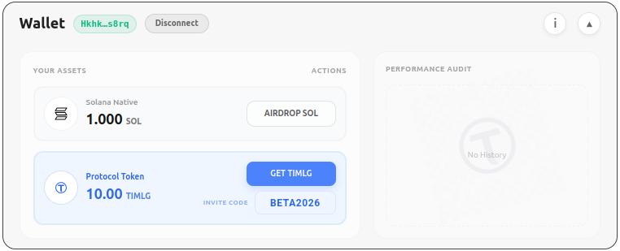

**Your Assets panel**
- **Solana Native (SOL)**: used for fees.
- **Protocol Token (TIMLG)**: used to play (each ticket stakes TIMLG).

**Actions**
- Airdrop and Get TIMLG are *Devnet-only* utilities.

---

## 2. Play a Round (Commit Phase)

The **Play Card** is the tactical center of the game. Here you analyze the timeline and place your predictions.

### 2.1 Understanding the Interface

The interface is divided into specific zones to give you full control over your timing and strategy:

**Top Bar: Timeline & Timer**
- **Center Top (Current Pulse)**: Shows the current verifiable random number (Pulse) of the network. This is the "now".
- **Top Right (Timer)**: A countdown showing exactly how much time remains before the current round closes. When this hits zero, no more tickets can be committed to this specific round.

**Center: Target Selection**
- **Left (Target Round)**: Shows the Round ID you are currently targeting (e.g., Round #6883). Each round corresponds to a specific future pulse.
- **Center Left (Ticket Preview)**: Displays the specific ticket you are about to commit.
- **Pulse Offset (Center Right)**: This selector controls *which* future round you are betting on.
    - **Offset**: Indicates the number of pulses into the future relative to the current pulse.
    - **Strategy**: You have the opportunity to target up to **5 open rounds** simultaneously. You can bet on the very next pulse (Offset +1) or strategize for a pulse further out (Offset +5).

**Bottom Right: Prediction Controls**
Here you choose the outcome for the assigned bit in your ticket:
- **BEAR (0)**: Betting the bit will be 0.
- **BULL (1)**: Betting the bit will be 1.
- **RAND**: Let the system pick a random prediction for you.

**Footer: Live Console**
- **Dropdown Console**: At the very bottom, there is a collapsible console. Open it to view a real-time log of actions, transaction signatures, and protocol events as they happen.

### 2.2 Committing Your Ticket
Once you have selected your **Pulse Offset** and **Prediction**:
1.  Review your choice in the Ticket Preview.
2.  Click the **COMMIT TICKET** button.
3.  Approve the transaction in your wallet.

Only after signing is your ticket sent to the blockchain.

---

## 3. Order History (Tracking Rounds & Tickets)

Order History is your timeline. It groups tickets under each round and shows what you can do *right now*.

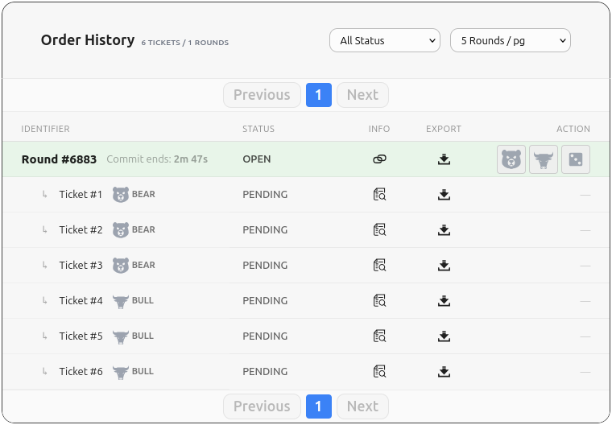

### 3.1 Common controls
- **All Status**: filter by ticket/round status.
- **Rounds per page**: pagination sizing.
- **Info / Export icons**: per round and per ticket.

### 3.2 Icons
- **INFO**: opens technical details (nonce, commitment, PDA, explorer links).
- **EXPORT**: exports ticket/round data for auditing/logging.

---

## 4. Round Lifecycle (All Phases)

Below are the main states you will see in the round row (the colored band).

### Phase A — OPEN (Commit Window)

- **Round status: OPEN** → you can still commit tickets.
- **Ticket status: PENDING** → your prediction is committed on-chain but still hidden (commit-reveal).

---

### Phase B — WAITING PULSE (Oracle pending)
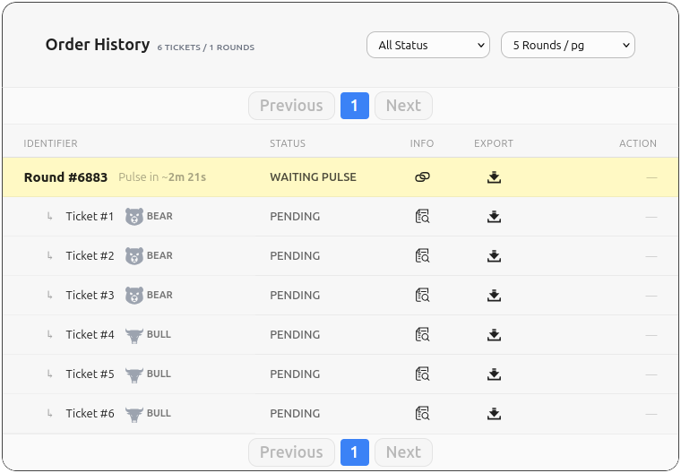

- **Round status: WAITING PULSE**
- No more commits.
- The protocol is waiting for the oracle pulse publication.

!!! info "Timeout protection exists"
    If the pulse does not arrive within the timeout, the round can enter **REFUND MODE** via the **Escape Hatch** (see Section 6).

---

### Phase C — REVEAL OPEN (Reveal Window)
Once the oracle pulse is published, the reveal window opens.

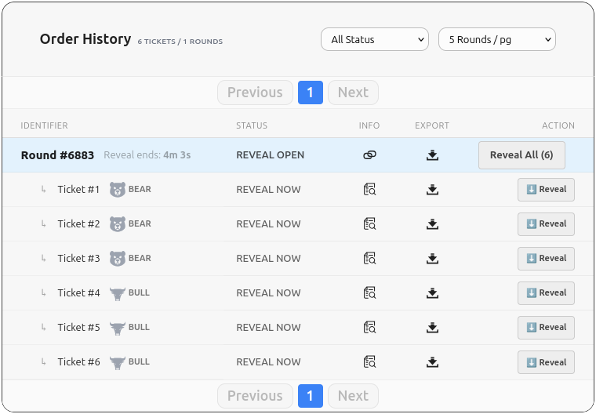

**Your actions**
- Reveal individually: **Reveal**
- Batch reveal: **Reveal All (N)**

**Ticket statuses you may see**
- **REVEAL NOW** → this ticket must be revealed by you.
- **WIN / LOSS** → once revealed, the outcome is known immediately.

Example with mixed outcomes + one pending reveal:

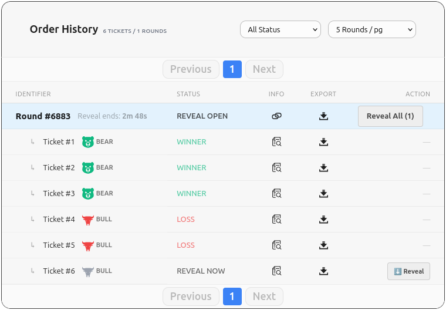

!!! danger "Expired tickets"
    If you do not reveal before the reveal window ends, the ticket becomes **EXPIRED**.  
    **EXPIRED = not revealed in time** (not claimable, treated as a lost opportunity).

---

### Phase D — AWAITING SETTLE (Settlement)
After reveal ends, the round settles (usually automatically).

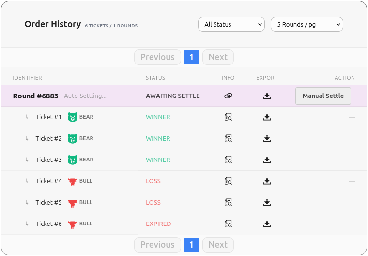

- **Round status: AWAITING SETTLE**
- Settlement finalizes payout availability for winners.

---

### Phase E — CLAIM WINDOW (Claim prizes)
When settlement is complete, winners can claim.

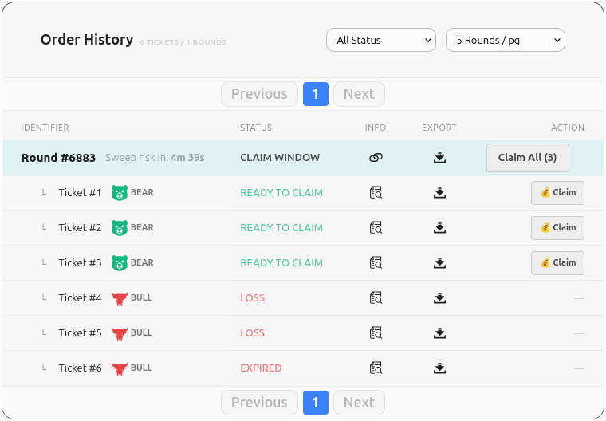

**Round header**
- **CLAIM WINDOW**
- May show a countdown like **“Sweep risk in: X”** (very important UX cue).

**Ticket statuses**
- **READY TO CLAIM** → prize available.
- **CLAIMED** → already claimed.

Batch claim:
- **Claim All (N)**

Individual claim:
- **Claim** button on each READY TO CLAIM ticket.

Example: some already claimed, one still pending claim (sweep risk visible):

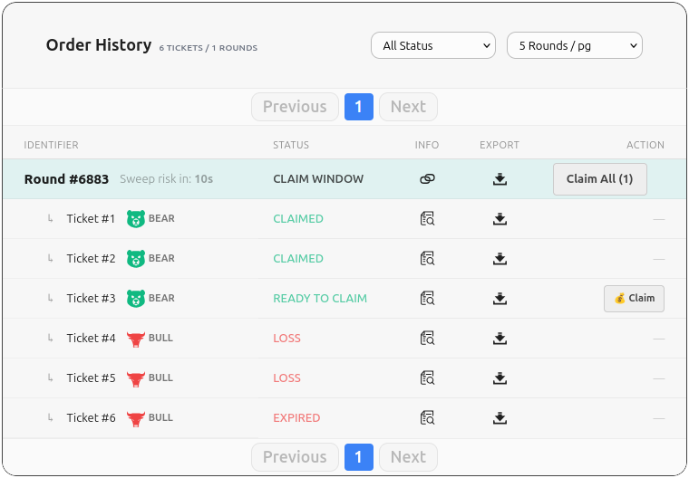

---

## 5. Final States (Archived / Done)

When the round is fully finished (and windows are closed), it becomes archived.

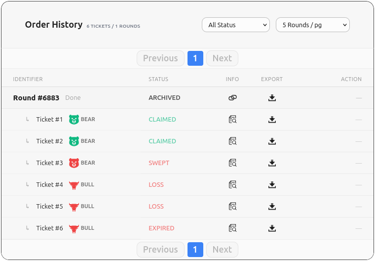

### 5.1 ARCHIVED
- **ARCHIVED = done** (no more actions possible)

### 5.2 SWEPT
- **SWEPT = you had a winning ticket, but did not claim in time**
- This usually happens after the claim window ends (or the grace period expires).

---

## 6. Edge Cases & Safety: Refund Mode (Escape Hatch)

If the oracle/pulse pipeline fails, the protocol protects users by entering **REFUND MODE**.

### 6.1 Refund available
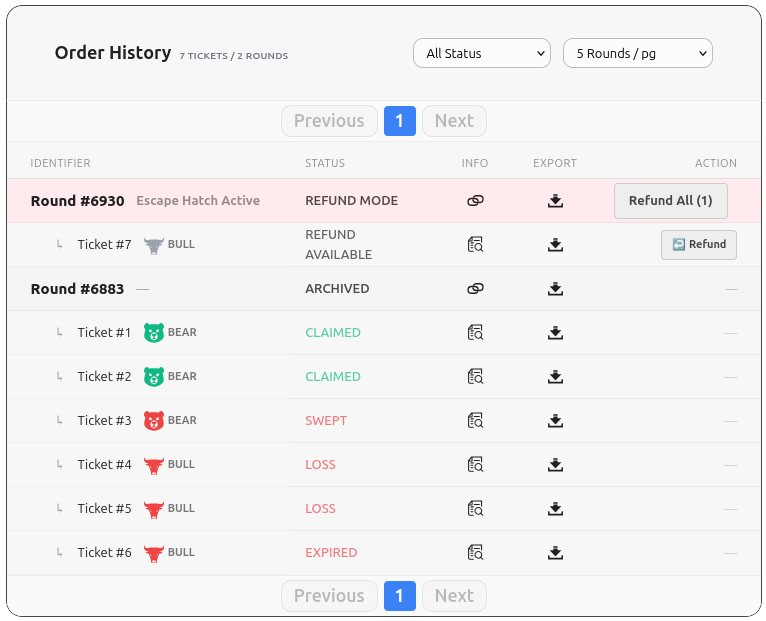

- Round status: **REFUND MODE**
- Note: **Escape Hatch Active**
- Ticket status: **REFUND AVAILABLE**
- Action: **Refund** or **Refund All (N)**

### 6.2 Refunded
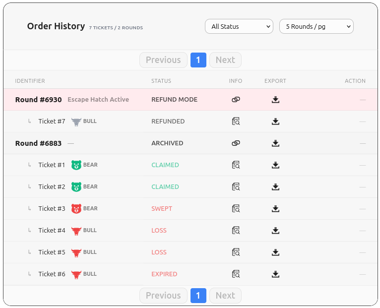

- Ticket status: **REFUNDED**
- Stake returned to your wallet.

---

## 7. Analytics & Verification (Performance + Flow Analysis)

The wallet screen includes a **Performance Audit** and a **Participation Volume Flow** chart that lets you audit where your tickets ended up.

### 7.1 Performance Audit cards
Typical metrics:
- **Net Profit (TIMLG)**: realized P&L based on claimed wins minus losses (Devnet numbers only).
- **Win Rate**: your win percentage.
- **Best Streak**: longest win streak.
- **Volume**: number of tickets played.

### 7.2 Sankey Flow (Participation Volume Flow)
The Sankey summarizes your lifecycle funnel:
- **Total** → **Played** → **Revealed** → splits into **Win / Loss**
- Win splits into **Claimed / Swept**
- Additional branches can include **Expired** and **Refunded**

**How to read key outcomes**
- **Expired**: committed but not revealed in time.
- **Swept**: won but not claimed in time.
- **Refunded**: safety mode triggered, stake returned.

---

## 8. Quick Status Glossary (User-facing definitions)

- **OPEN**: you can still commit tickets.
- **PENDING**: committed; reveal not done yet.
- **WAITING PULSE**: waiting for oracle pulse.
- **REVEAL OPEN**: reveal window open; reveal required.
- **REVEAL NOW**: action needed; reveal this ticket.
- **WIN / LOSS**: outcome known after reveal.
- **EXPIRED**: not revealed in time.
- **AWAITING SETTLE**: settlement in progress.
- **CLAIM WINDOW**: winners can claim now.
- **READY TO CLAIM**: prize available.
- **CLAIMED**: prize claimed successfully.
- **SWEPT**: prize not claimed in time.
- **REFUND MODE**: escape hatch active (protocol safety).
- **REFUND AVAILABLE**: you can withdraw your stake.
- **REFUNDED**: stake returned.
- **ARCHIVED**: round finalized; no actions remain.
