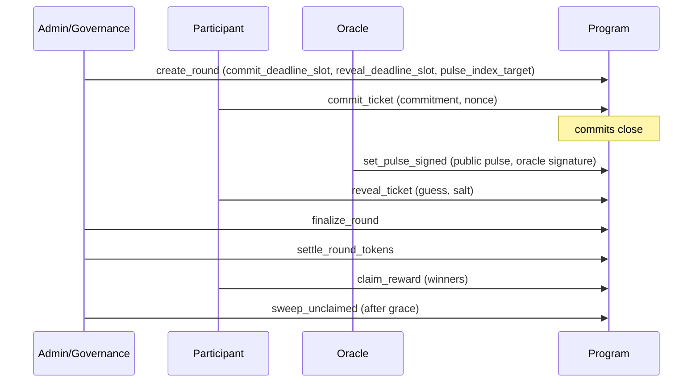

# TIMLG Protocol

TIMLG is a **commit–reveal protocol** for verifiable coordination using **slot-bounded rounds** and a publicly verifiable **randomness pulse**.

[Read the Whitepaper](whitepaper/){ .md-button .md-button--primary }
[Protocol (MVP Specs)](protocol/overview/){ .md-button }

---

## Why TIMLG exists (beyond the technical)

Modern coordination breaks down when outcomes depend on **trust**, **private timing**, or **hidden information**.

TIMLG’s goal is simple:

- enable groups to run **fair, replay-safe, auditable** coordination rounds  
- where participants must commit **before** a public randomness event is knowable  
- and where outcomes can be verified by anyone from public state

In other words: TIMLG turns “we all agree this was fair” into something that can be **proven**.

---

## What TIMLG is trying to solve

### The problem
Many coordination systems fail because:
- participants can adapt after seeing partial information
- operators can “decide the randomness” after the fact
- results are hard to reproduce or audit

### The TIMLG approach
TIMLG enforces:
- **anti-leakage timing** (commit window closes before the pulse is knowable)
- **one-shot oracle publishing** (signed pulse, verified on-chain)
- **deterministic settlement** (same inputs → same outputs, publicly checkable)

---

## What TIMLG does (in one minute)

TIMLG lets participants:

1) **Commit** a private guess during a round’s commit window  
2) An **oracle publishes** a 512-bit pulse (tied to a public source) after commits close  
3) **Reveal** the guess + salt so the program can verify the commitment  
4) The program **settles** outcomes deterministically and enables **claims** (winners)

This site is the **public documentation hub**. It describes *what the protocol does* and how it behaves at the MVP level, without exposing operational secrets.

!!! note "Public docs vs private operations"
    We intentionally do **not** publish private keys, signer infrastructure, privileged configs, or production oracle/relayer runbooks.

---

## Who could use this (examples)

TIMLG is a primitive for any system that needs **verifiable fairness** without trusting a single coordinator:

- **On-chain experiments** (fair trials where timing matters)
- **Public draws / lotteries** with auditable rules (non-custodial designs)
- **Decentralized coordination** where participants must commit before a known event
- **Research protocols** that require reproducible outcomes and public auditability

(Concrete deployments are intentionally left out until devnet parity is stable.)

---

## Core principles

- **Verifiable over persuasive**: the chain should prove what happened.
- **Rules are public, operations are private**: specs are transparent; signers/runbooks stay private.
- **Deterministic settlement**: no “manual” adjudication once the round is finalized.
- **Replay-safety**: signatures and pulses must not be reusable across rounds.

---

## How it works (as implemented in the MVP)

---

## Where to start

-   **Whitepaper**

    Canonical narrative: motivation, system model, and design rationale.

    [Open Whitepaper](whitepaper/)

-   **Protocol**

    MVP-aligned specs: log format, timing windows, settlement rules, token flow, treasury.

    [Read Protocol](protocol/overview/)

-   **Roadmap**

    Milestones and “definition of done” for each stage (MVP → devnet → hardening).

    [View Roadmap](roadmap/)

-   **Status**

    Current progress and the next concrete tasks.

    [View Status](status/)

---

## Support (optional)

If you want to support development, see **Support** in the top menu.
