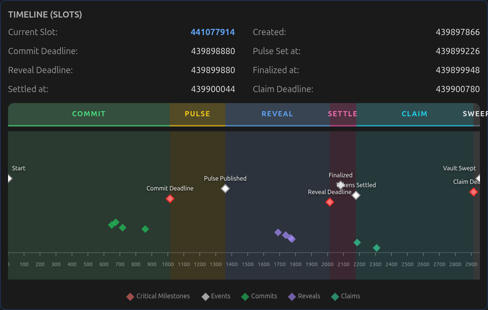
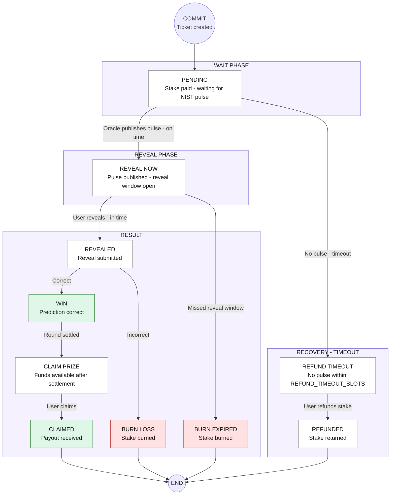

#  TIMLG Protocol

TIMLG is a **public, auditable experiment protocol** built on Solana.

It runs slot-bounded **commit–reveal rounds** against a publicly verifiable **512-bit randomness pulse**. The goal is to measure whether any strategy can predict a bit **under strict anti-leakage constraints** (“Hawking Wall”) — and to make that measurement reproducible by anyone.

<a href="/beta/" class="md-button md-button--primary" style="margin: 0; display: flex; align-items: center; gap: 8px;">Try the Devnet Beta New</a>

!!! warning "Experimental Phase (Devnet)"
    TIMLG is currently in an **experimental phase on Solana Devnet**. Timing parameters are intentionally short to facilitate testing. Tokens and results on this network have no real-world value.

---

## Token Specifications

  <!-- 1. Identity Header -->
  

      
      

         <h3 style="margin: 0; font-size: 1.1rem; color: #0f172a; line-height: 1;">TIMLG $TIMLG</h3>
         

             SPL-2022
             Devnet
         

      

  

  <!-- 2. Technical Stats (Simplified for Devnet) -->
  

      

          
Circulating

          
Dynamic

          
+1/-1 Mechanism

      

      

          
Max Supply

          
Elastic

          
Self-Balancing

      

  

   <!-- 3. Technical Specs Footer -->
   

       

           Mint:
           <a href="https://explorer.solana.com/address/7kpdb6snovzpm5T5rU6BKJspX7qMUwaSVv9Ki5zqSHjy/attributes?cluster=devnet" target="_blank" style="font-family: monospace; color: var(--azulito-blue); font-weight: 600; text-decoration: none;">7kpdb6snovzpm5T5rU6BKJspX7qMUwaSVv9Ki5zqSHjy ↗</a>
       

       

           Decimals:
           9
       

  

### Cost model (current vs target)

- **Current (Devnet / MVP):** users may need a small amount of SOL for **transaction fees** to interact with the program.
- **Target design:** the protocol is intended to run **via a relayer**, making participation **cost-free for users** (fees sponsored by the relayer).
- **Rent deposits:** SOL used for rent deposits can be **recovered** by closing ticket accounts after settlement.

!!! note "Decimals, base units, and ticket cleanup"
    - Amounts are stored in **base units** (`u64`). With `decimals = 9`, **1 TIMLG = 1_000_000_000 base units**.
    - `claim_reward` pays **SPL tokens** only. To reclaim the ticket account’s **SOL rent deposit**, the user closes the ticket (`close_ticket`) after settlement (and after claim if you won).

---

## How it works (The Play Loop)

The protocol operates in continuous, overlapping rounds. Users participate via the interface:

1.  **Commit**: Choose a bit (Bear/Bull) and stake 1 TIMLG. Prediction is hashed and salted (Nonce) for privacy.
2.  **Wait**: The commit window closes. The protocol waits for the target pulse (e.g., NIST Beacon).
3.  **Reveal**: Once published, you reveal your guess. The protocol verifies it against your original hash.
4.  **Settle**: Winners claim rewards (stake + 1 unit); losers' stakes are burned.
5.  **Cleanup (SOL rent)**: Close your finished ticket to recover the ticket account’s SOL rent deposit.

### Round Timeline (Slot-Bound Windows)

The protocol uses strict slot-based timing to ensure the "Hawking Wall" (unpredictability).

{ width="100%" style="border-radius: 8px; box-shadow: 0 4px 6px -1px rgba(0, 0, 0, 0.1); border: 1px solid #e5e7eb;" }

### The Interface: Transparency in Action

The **Play Card** reveals all technical details (Assigned Bit, Nonce, Commitment Hash) to ensure every prediction is verifiable and auditable in real-time.

{ width="100%" style="border-radius: 8px; box-shadow: 0 4px 6px -1px rgba(0, 0, 0, 0.1); border: 1px solid #e5e7eb;" }

---

## What TIMLG is trying to achieve (Scientific Goals)

### 1) Audit randomness providers
Many systems rely on "randomness" provided by an oracle. TIMLG turns that into an **audit trail**: if the "randomness" is manipulable or leaky, a winning strategy will emerge on-chain.

### 2) Measure "predictability under constraints"
If a strategy claims an edge, it must survive commit–reveal timing and deterministic settlement.

---

## Radical Transparency (Visual Audit)

Every ticket follows a pre-defined on-chain state machine. You can audit the entire flow through the system.

### Ticket Lifecycle Flow

### Participation Volume Flow (Sankey Audit)
The protocol provides categorical proof of where every token ends up: claimed, burned (loss/expired), or swept.

{ width="100%" style="border-radius: 8px; box-shadow: 0 4px 6px -1px rgba(0, 0, 0, 0.1); border: 1px solid #e5e7eb;" }

## Economics per ticket (MVP)

Per ticket, exactly **1 TIMLG unit** is escrowed.

| Outcome | Condition | What happens (MVP) |
|---|---|---|
| **WIN** | Matches the ticket’s target bit | Winner Claims: stake refund + **1 TIMLG minted reward** |
| **LOSE** | Does not match | Stake is **burned** |
| **NO-REVEAL** | No valid reveal by deadline | Stake is **burned** |

---

## Interpretation: The Hypothesis Ladder

TIMLG follows a pre-registered scientific ladder to interpret results, avoiding sensationalism:

*   **H0 — Null:** no effect (ordinary randomness).
*   **H1 — Bug:** implementation error.
*   **H2 — Leakage:** timing/data exposure.
*   **H3 — Oracle bias:** source manipulation.
*   **H4 — Unknown strategy:** a real advantage survives constraints.
*   **H5 — Exotic framing:** last resort explanation.

The practical rule is: **an anomaly is a reason to tighten constraints and replicate**, not to declare victory.

---

## Where to start

-   **Whitepaper**

    Canonical narrative: motivation, non-claims, hypothesis ladder, and design rationale.

    [Open Whitepaper](whitepaper/index.md)

-   **Protocol**

    MVP specification: timing windows, settlement rules, treasury routing, and log formats.

    [Read Protocol Specs](protocol/overview.md)

-   **Roadmap**

    Milestones and “definition of done” (MVP → devnet parity → hardening).

    [View Roadmap](roadmap/index.md)

-   **Support**

    If you want to support development, see the support page.

    [Support](support/index.md)

