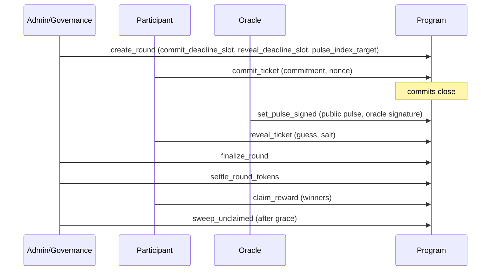

# TIMLG Protocol

TIMLG is a **commit–reveal protocol** for verifiable coordination using **slot‑bounded rounds** and a publicly verifiable **randomness pulse**.

[Read the Whitepaper](whitepaper/){
  .md-button .md-button--primary
}
[Protocol (MVP Specs)](protocol/overview/){ .md-button }
[Roadmap](roadmap/){ .md-button }
[Status](status/){ .md-button }

---

## What TIMLG does (in one minute)

TIMLG lets participants:

1) **Commit** a private guess during a round’s commit window  
2) An **oracle publishes** a 512‑bit pulse (tied to a public source) after commits close  
3) **Reveal** the guess + salt so the program can verify the commitment  
4) The program **settles** outcomes deterministically and enables **claims** (winners)

This site is the **public documentation hub**. It describes *what the protocol does* and how it behaves at the MVP level, without exposing operational secrets.

!!! note "Public docs vs private operations"
    We intentionally do **not** publish private keys, signer infrastructure, privileged configs, or production oracle/relayer runbooks.

---

## How it works (as implemented in the MVP)

---

## Where to start

-   **Whitepaper**

    Canonical narrative: motivation, system model, and design rationale.

    [Open Whitepaper](whitepaper/)

-   **Protocol**

    MVP‑aligned specs: log format, timing windows, settlement rules, token flow, treasury.

    [Read Protocol](protocol/overview/)

-   **Roadmap**

    Milestones and “definition of done” for each stage (MVP → devnet → hardening).

    [View Roadmap](roadmap/)

-   **Status**

    Current progress and the next concrete tasks.

    [View Status](status/)

---

## Support (optional)

If you want to support development, see **Support** in the top menu.
