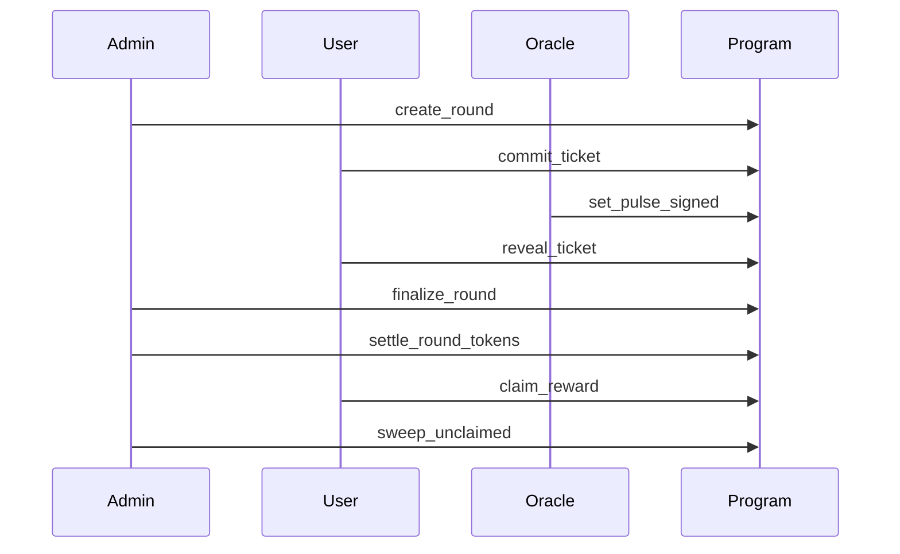

# TIMLG Protocol

TIMLG is a **public, auditable experiment protocol** built on Solana.

It runs slot-bounded **commit–reveal rounds** against a publicly verifiable **512-bit randomness pulse**. The goal is to measure whether any strategy can predict a bit **under strict anti-leakage constraints** (“Hawking Wall”) — and to make that measurement reproducible by anyone.

[Read the Whitepaper](whitepaper/){ .md-button .md-button--primary }
[Protocol (MVP Specs)](protocol/overview/){ .md-button }

---

## What TIMLG is trying to achieve (non-technical)

### 1) Audit randomness providers and publishing pipelines
Many systems rely on “randomness” provided by an oracle, beacon, or infrastructure operator. TIMLG turns that into an **audit trail**:

- rounds target a specific pulse index (public source),
- the oracle publishes the pulse on-chain with a verifiable signature,
- the program settles outcomes deterministically.

### 2) Measure “predictability under constraints”
If a strategy claims an edge, it must survive:

- commit–reveal timing,
- deterministic on-chain rules,
- reproducible replication by independent observers.

### 3) Preserve credibility with “non-claims”
TIMLG is **not an investment product** and makes **no claims** about guaranteed profit or exotic explanations. It is a measurement framework.

!!! note "What this site is"
    This site is the **public documentation hub**. It describes the protocol surface, threat model, invariants, and public evidence — without exposing operational secrets.

---

## What TIMLG does (in one minute)

1) **Commit** a private guess during a round’s commit window  
2) The commit **escrows exactly 1 TIMLG** (one whole token unit) into the round vault  
3) After commits close, an **oracle publishes** a 512-bit pulse tied to a public source  
4) **Reveal** the guess + salt so the program can verify the commitment  
5) The program **settles** outcomes deterministically and enables **claims** (winners)

!!! info "Whole-token unit (no decimals)"
    TIMLG is designed as a **whole-unit token (decimals = 0)**. The on-chain config uses an integer `stake_amount`, and deployments are expected to use a TIMLG mint with `decimals = 0` so that **`stake_amount = 1` means “stake 1 TIMLG.”**

---

## Economics per ticket (MVP)

Per ticket, one unit of TIMLG is escrowed. After finalize + settlement:

| Outcome | Condition | What happens (MVP) |
|---|---|---|
| **WIN** | Valid reveal and matches the ticket’s target bit | Winner **claims**: stake refund (transfer) + **+1 TIMLG minted reward** |
| **LOSE** | Valid reveal but does not match | Stake is **burned** during token settlement |
| **NO-REVEAL** | No valid reveal by deadline (or invalid reveal) | Stake is transferred to **SPL treasury** (no burn, no mint) |

!!! important "MVP nuance: rewards are minted on claim"
    The +1 TIMLG reward is minted **only when the winner claims**. If a winner never claims, that reward is never minted (while loser burns still occur).

---

## What does a user pay in SOL?

A user generally pays **small Solana transaction fees** (in SOL) for:

- `commit_ticket` (always)
- `reveal_ticket` (always)
- `claim_reward` (only if they win)

In this MVP, **winning requires a claim** (user signs the claim transaction). A relayer could sponsor fees later, but the default flow is user-paid SOL fees.

!!! warning "Public docs vs private operations"
    We intentionally do **not** publish private keys, signer infrastructure, privileged configs, or production oracle/relayer runbooks.

---

## How results are interpreted (H0–H5 ladder)

TIMLG follows a pre-registered “hypothesis ladder” to avoid over-interpreting noise:

- **H0 — Null:** no effect (ordinary randomness)
- **H1 — Bug:** implementation error or measurement artifact
- **H2 — Leakage:** early access / timing / data exposure
- **H3 — Oracle bias:** source or publishing pipeline is biased or manipulable
- **H4 — Unknown strategy:** a real advantage survives constraints
- **H5 — Exotic framing:** last resort, only after exhausting ordinary explanations

The practical rule is: **an anomaly is a reason to tighten constraints and replicate**, not to declare victory.

---

## How it works (as implemented in the MVP)

---

## Where to start

-   **Whitepaper**

    Canonical narrative: motivation, non-claims, hypothesis ladder, and design rationale.

    [Open Whitepaper](whitepaper/)

-   **Protocol**

    MVP specification: timing windows, settlement rules, treasury routing, and log formats.

    [Read Protocol Specs](protocol/overview/)

-   **Roadmap**

    Milestones and “definition of done” (MVP → devnet parity → hardening).

    [View Roadmap](roadmap/)

-   **Support**

    If you want to support development, see the support page.

    [Support](support/)

