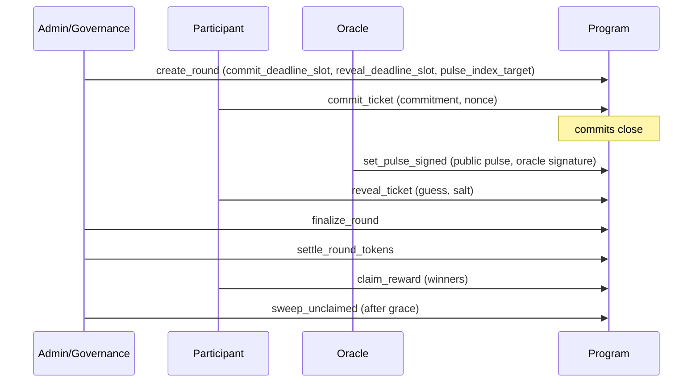

# TIMLG Protocol

TIMLG is a **public, auditable experiment protocol** built on a strict **commit–reveal** scheme with **slot‑bounded rounds** and a publicly verifiable **randomness pulse**.

Its purpose is to measure whether any strategy can predict **future beacon‑derived bits** above chance under **anti‑leakage constraints** (“the Hawking Wall”) — and to make that measurement reproducible by anyone.

[Read the Whitepaper](whitepaper/){ .md-button .md-button--primary }
[Protocol (MVP Specs)](protocol/overview/){ .md-button }

---

## What TIMLG is trying to achieve (non‑technical)

### 1) Audit randomness providers and publishing pipelines
Many systems rely on “randomness” provided by an oracle, beacon, or infrastructure operator. TIMLG turns that into an **audit trail**:

- rounds target a **pre‑registered** public randomness source (e.g., a beacon pulse index)
- the oracle publishes a pulse with **public evidence + a verifiable signature**
- anyone can verify parameters, timing, and outcomes from on‑chain history

### 2) Detect anomalies in prediction performance (without jumping to conclusions)
TIMLG is designed to surface **statistical irregularities** (e.g., unusual hit rates, bit‑position effects, streaks), then force a disciplined interpretation:

- **replicate first**
- rule out ordinary causes (bias, leakage, manipulation) before stronger interpretations

### 3) Preserve credibility with “non‑claims”
TIMLG is **not an investment product** and makes **no claims** of guaranteed profit or exotic explanations. It is a measurement framework.

!!! note "What this site is"
    This site is the **public documentation hub**. It describes protocol rules, constraints, and public evidence — without exposing operational secrets.

---

## What TIMLG does (in one minute)

1) **Commit** a private guess during a round’s commit window  
2) After commits close, an **oracle publishes** a 512‑bit pulse tied to a public source  
3) **Reveal** the guess + salt so the program can verify the commitment  
4) The program **settles** outcomes deterministically and enables **claims** (winners)

!!! warning "Public docs vs private operations"
    We intentionally do **not** publish private keys, signer infrastructure, privileged configs, or production oracle/relayer runbooks.

---

## How results are interpreted (H0–H5 ladder)

TIMLG follows a pre‑registered “hypothesis ladder” to avoid over‑interpreting noise:

- **H0 — Chance:** results converge to 50/50 over time  
- **H1 — Bias / artifact:** bugs, bit‑extraction conventions, serialization mismatches, edge cases  
- **H2 — Operational leakage:** timing errors or information leaks that break the Hawking Wall  
- **H3 — Oracle / relayer manipulation:** equivocation, censorship, selective inclusion/exclusion  
- **H4 — Non‑trivial correlations:** reproducible effects after hardening and replication  
- **H5 — Exotic framing:** last resort, only after exhausting ordinary explanations

The practical rule is: **an anomaly is a reason to tighten constraints and replicate**, not to declare victory.

---

## How it works (as implemented in the MVP)

---

## Where to start

-   **Whitepaper**

    Canonical narrative: motivation, non‑claims, hypothesis ladder, and design rationale.

    [Open Whitepaper](whitepaper/)

-   **Protocol**

    MVP‑aligned specs: log format, timing windows, settlement rules, token flow, treasury, BitIndex.

    [Read Protocol](protocol/overview/)

-   **Roadmap**

    Milestones and “definition of done” (MVP → devnet parity → hardening).

    [View Roadmap](roadmap/)

-   **Status**

    Current progress and next concrete tasks.

    [View Status](status/)

---

## Support (optional)

If you want to support development, see **Support** in the top menu.