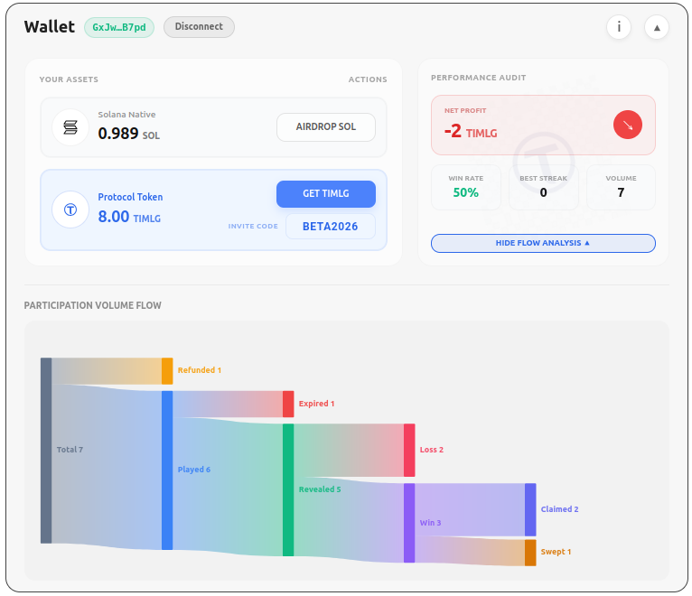

#  TIMLG Protocol

TIMLG is a **public, auditable experiment protocol** built on Solana.

It runs slot-bounded **commit–reveal rounds** against a publicly verifiable **512-bit randomness pulse**. The goal is to measure whether any strategy can predict a bit **under strict anti-leakage constraints** (“Hawking Wall”) — and to make that measurement reproducible by anyone.

<a href="/beta/" class="md-button md-button--primary" style="margin: 0; display: flex; align-items: center; gap: 8px;">Try the Devnet Beta New</a>

!!! warning "Experimental Phase (Devnet)"
    TIMLG is currently in an **experimental phase on Solana Devnet**. Timing parameters are intentionally short to facilitate testing. Tokens and results on this network have no real-world value.

---

## Token Specifications

  

    
<strong>$TIMLG</strong>

    
<strong>Decimals</strong> 0 (Whole units only)

    
<strong>Mint (Devnet)</strong> <small><code>7nJ9vaCpjo3zDY1fzZv1KicjoZ6yPpzHFcKq3HDh8cEf</code></small>

    
<strong>Supply Model</strong> Mint on Claim / Burn on Loss

  

---

## How it works (The Play Loop)

The protocol operates in continuous, overlapping rounds. Users participate via the interface:

1.  **Commit**: Choose a bit (Bear/Bull) and stake 1 TIMLG.
2.  **Wait**: The commit window closes, and the protocol waits for the Oracle Pulse.
3.  **Reveal**: Once the pulse is published, you reveal your encrypted guess.
4.  **Settle**: Winners claim rewards; losers' stakes are burned.

{ width="100%" style="border-radius: 8px; box-shadow: 0 4px 6px -1px rgba(0, 0, 0, 0.1); border: 1px solid #e5e7eb;" }

---

## What TIMLG is trying to achieve (Scientific Goals)

### 1) Audit randomness providers
Many systems rely on "randomness" provided by an oracle. TIMLG turns that into an **audit trail**: if the "randomness" is manipulable or leaky, a winning strategy will emerge on-chain.

### 2) Measure "predictability under constraints"
If a strategy claims an edge, it must survive commit–reveal timing and deterministic settlement.

### 3) Visual Evidence (Sankey Audit)
Every token is accounted for. The protocol provides radical transparency on where funds go: claimed, burned (loss), or swept (unclaimed wins).

{ width="100%" style="border-radius: 8px; box-shadow: 0 4px 6px -1px rgba(0, 0, 0, 0.1); border: 1px solid #e5e7eb;" }

---

## Economics per ticket (MVP)

Per ticket, exactly **1 TIMLG unit** is escrowed.

| Outcome | Condition | What happens (MVP) |
|---|---|---|
| **WIN** | Matches the ticket’s target bit | Winner Claims: stake refund + **1 TIMLG minted reward** |
| **LOSE** | Does not match | Stake is **burned** |
| **NO-REVEAL** | No valid reveal by deadline | Stake is **burned** |

---

## Interpretation: The Hypothesis Ladder

TIMLG follows a pre-registered scientific ladder to interpret results, avoiding sensationalism:

*   **H0 — Null:** no effect (ordinary randomness).
*   **H1 — Bug:** implementation error.
*   **H2 — Leakage:** timing/data exposure.
*   **H3 — Oracle bias:** source manipulation.
*   **H4 — Unknown strategy:** a real advantage survives constraints.
*   **H5 — Exotic framing:** last resort explanation.

The practical rule is: **an anomaly is a reason to tighten constraints and replicate**, not to declare victory.

---

## Where to start

-   **Whitepaper**

    Canonical narrative: motivation, non-claims, hypothesis ladder, and design rationale.

    [Open Whitepaper](whitepaper/index.md)

-   **Protocol**

    MVP specification: timing windows, settlement rules, treasury routing, and log formats.

    [Read Protocol Specs](protocol/overview.md)

-   **Roadmap**

    Milestones and “definition of done” (MVP → devnet parity → hardening).

    [View Roadmap](roadmap/index.md)

-   **Support**

    If you want to support development, see the support page.

    [Support](support/index.md)

