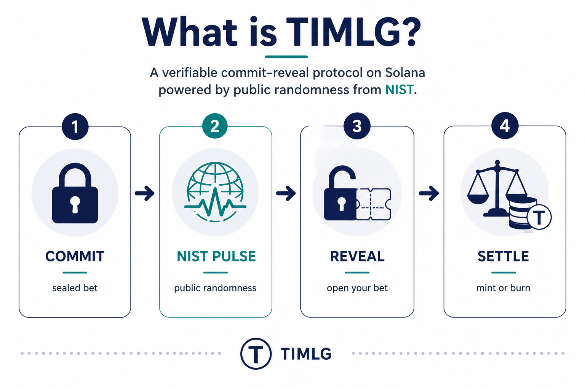
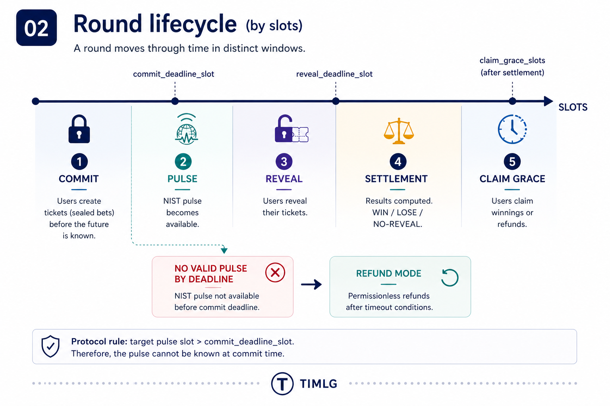
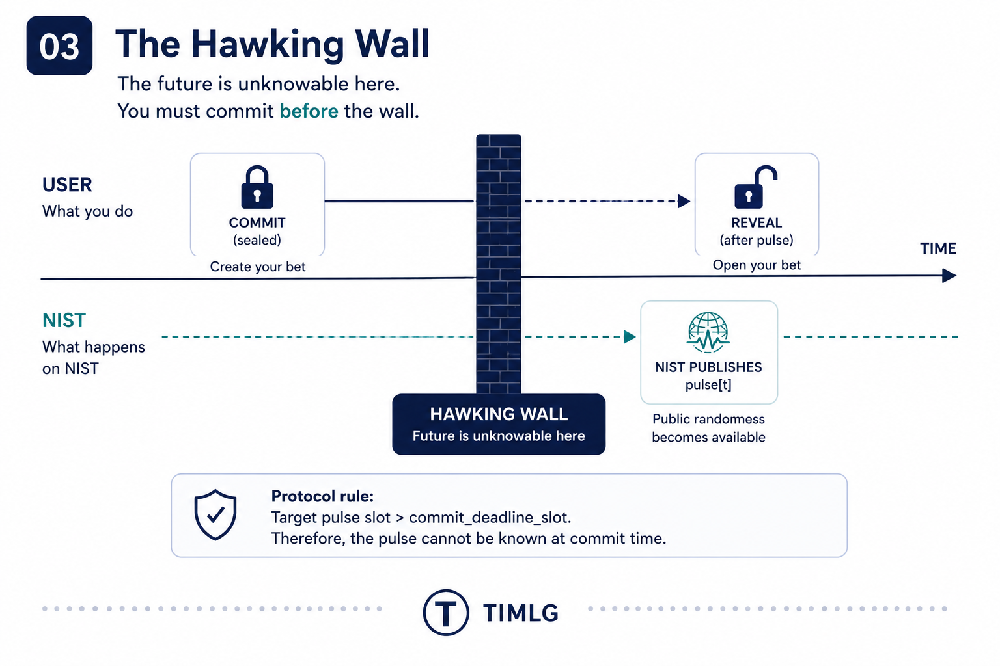
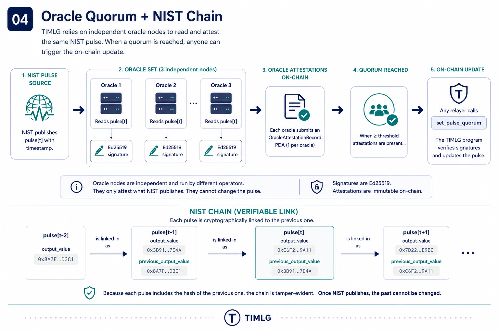
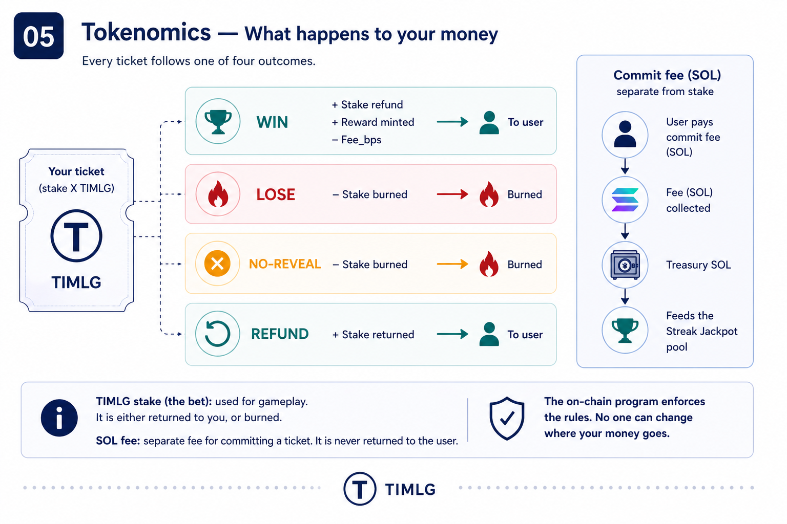
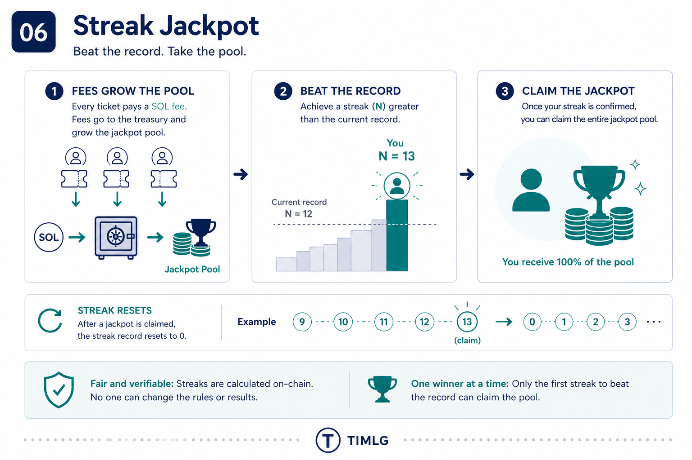

---
hide:
  - title
---

# TIMLG Protocol

**A verifiable, slot-bounded commit-reveal protocol on Solana.**

TIMLG couples deterministic on-chain settlement with a publicly verifiable 512-bit randomness pulse,
wallet-level statistics, and a documentation set designed for technical verification.

[Protocol Specification](protocol/overview.md){ .md-button .md-button--primary }
[Current Status](status/status.md){ .md-button }
[Devnet App](beta.md){ .md-button }

---

## What TIMLG is, in one picture

You commit a hidden bet. The protocol then publishes a public random pulse from NIST. You reveal
your bet. The on-chain program decides win or lose deterministically. Tokens settle automatically.

<figure class="infographic" markdown>
{ loading=lazy }
</figure>

[Read the full protocol overview →](protocol/overview.md)

---

## How a round works

Every round is a slot-bounded sequence of windows. The order is fixed: commits close before the
pulse arrives, the pulse closes before reveals expire, and settlement runs on top of the result.

<figure class="infographic" markdown>
{ loading=lazy }
</figure>

[Read the lifecycle in detail →](LIFECYCLE.md)

---

## Why nobody can cheat — the Hawking Wall

Commits must be sealed **before** the pulse becomes public. There is a wall between "what you can
know when you bet" and "what the protocol will use to settle". The wall is enforced by Solana
slots, not by trust.

<figure class="infographic" markdown>
{ loading=lazy }
</figure>

[Read the timing windows →](protocol/timing_windows.md)

---

## Where the randomness comes from

A set of independent oracles each fetches the same NIST Beacon pulse and signs it. The on-chain
program only accepts the pulse when **a threshold of those signatures agrees**, and it verifies a
cryptographic chain back to the previous accepted pulse. No single oracle can substitute the value.

<figure class="infographic" markdown>
{ loading=lazy }
</figure>

[Read the oracle trust model →](protocol/oracle_trust_model.md)

---

## What happens to your tokens

Every ticket has four possible terminal states. Wins mint a reward and refund the stake. Losses and
no-reveals burn the stake — the protocol is deflationary by design. Refunds are a safety fallback
for oracle outages. The per-ticket SOL service fee funds a separate jackpot pool.

<figure class="infographic" markdown>
{ loading=lazy }
</figure>

[Read the tokenomics →](protocol/tokenomics.md)

---

## The Streak Jackpot

Every ticket commit pays a small SOL fee that accumulates in an on-chain pool. Anyone whose
consecutive-win streak beats the global record can claim the entire pool in one transaction — and
becomes the new record holder.

<figure class="infographic" markdown>
{ loading=lazy }
</figure>

[Read the Streak Jackpot mechanic →](protocol/streak_jackpot.md)

---

## Protocol snapshot

| Topic | Current Devnet MVP |
|---|---|
| **Randomness flow** | Commit window closes before the oracle pulse is published; the pulse is verified on-chain |
| **Outcome model** | WIN / LOSE / NO-REVEAL / REFUND |
| **Settlement rule** | WIN = claimable stake refund + reward mint; LOSE and NO-REVEAL = burn |
| **Oracle model** | OracleSet quorum (M-of-N Ed25519) with on-chain NIST chaining (`output_value` + precommitment) |
| **Round creation** | Permissionless, gated by an on-chain canonical-target rule |
| **Wallet analytics** | `UserStats` tracks cumulative counters and consecutive-win streaks |
| **Streak incentive** | `StreakLeaderboard` PDA + `claim_streak_jackpot` (active on-chain) |

---

## Verifiable surfaces today

| Surface | What a reviewer can check |
|---|---|
| **Lifecycle** | Commit → pulse → reveal → settle → claim / refund / sweep / close |
| **Economic routing** | Stake escrow, deflationary burn, reward mint, fee routing, treasury surfaces |
| **Account model** | PDAs for config, rounds, tickets, stats, vaults, treasuries, oracle set, leaderboard |
| **User history** | Wallet-level counters and consecutive-win streaks via `UserStats` |
| **Timing** | Slot-bound deadlines, grace windows, and refund timeouts |
| **Source code** | Anchor program, IDL, and TypeScript SDK at [`github.com/richarddmm/timlg-protocol`](https://github.com/richarddmm/timlg-protocol) |

---

## For technical readers

If you want to go deeper than the visual tour above:

- **Protocol Overview**

    Architecture, lifecycle, oracle quorum boundaries, and treasury surfaces.

    [Open Overview](protocol/overview.md)

- **Oracle Trust Model**

    Quorum-based pulse acceptance, on-chain NIST chaining, and the recovery mode.

    [Read Oracle Trust](protocol/oracle_trust_model.md)

- **Settlement and Tokenomics**

    Outcome routing, burn logic, fee model, and the streak jackpot funding source.

    [Read Settlement Rules](protocol/settlement_rules.md)

- **User Statistics & Streak Jackpot**

    Wallet-level counters, streak rules, and the on-chain jackpot claim flow.

    [Open User Statistics](protocol/user_stats.md)

---

## Documentation policy

The site distinguishes clearly between:

- **implemented MVP behavior** (current Devnet deployment),
- **future hardening** (mainnet trajectory), and
- **explicit out-of-scope material** (privileged operational topology and key custody).

That distinction is deliberate. It keeps the protocol easier to review, easier to audit, and easier
to evolve without rewriting past claims.

---

## Downloads and historical references

The canonical specification of the protocol lives in the [Architecture Overview](protocol/overview.md)
and the rest of the [Protocol section](protocol/overview.md). The PDF documents below are kept for
historical and external-citation reference; in case of any discrepancy, the live protocol pages and
the on-chain program are authoritative.

- [TIMLG Whitepaper v1.2](assets/TIMLG_Whitepaper_v1.2.pdf) — *Live audit integration and protocol dynamic hardening (February 2026)*
- [TIMLG Whitepaper v1.1](assets/whitepaper_TIMLG_v1.1.pdf) — *Pre-multi-oracle revision (February 2026)*
- [TIMLG Whitepaper v1.0-beta](assets/whitepaper_TIMLG_v1.0-beta.pdf) — *Initial protocol-implementation alignment (January 2026)*
- [TIMLG Whitepaper v0.1](assets/whitepaper_TIMLG_v0.1.pdf) — *Initial conceptual draft (December 2025)*

Source code: [github.com/richarddmm/timlg-protocol](https://github.com/richarddmm/timlg-protocol).
