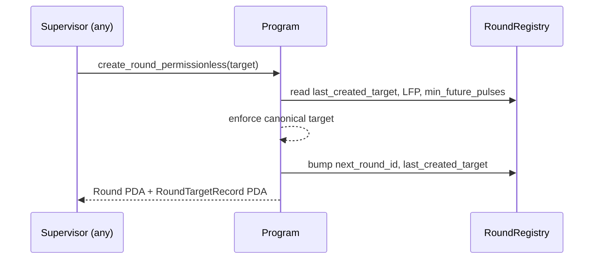
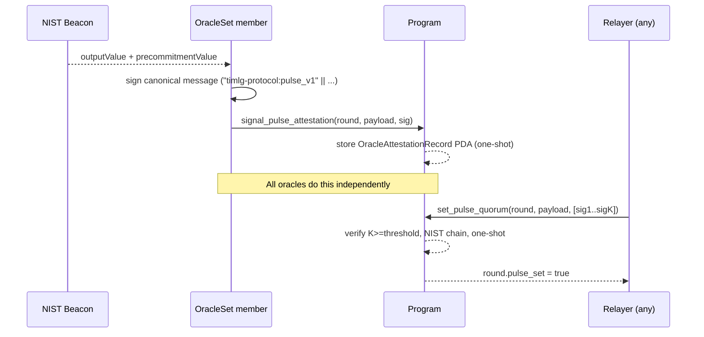

# Technical Architecture: Operational Automation

| Metadata | Specification |
|---|---|
| **Document ID** | TP-OPER-001 |
| **Component** | Off-chain operator and oracle SDKs |
| **Last updated** | April 2026 |

The TIMLG protocol is automated by a set of off-chain components that **only act through public,
permissionless or quorum-gated instructions**. None of them holds privileged consensus power.

---

## 1. Components

| Component | Repo path | Domain | Authority |
|---|---|---|---|
| **`protocol-supervisor-sdk`** | `protocol-supervisor-sdk/` | Round lifecycle | Permissionless: round creation, quorum assembly, settle, sweep, close |
| **`oracle-node-sdk`** | `oracle-node-sdk/` | Oracle attestations | Member of `OracleSet`: signs canonical pulse / anchor messages and posts attestation PDAs |
| **`ticket-manager-sdk`** | `ticket-manager-sdk/` | User actions | Player: commit, reveal, claim, refund, jackpot claim |
| **TypeScript SDK** | `sdk/` | Library | Used by all of the above; `TimlgPlayer`, `TimlgSupervisor`, `TimlgAdmin` |

The supervisor never participates in consensus. Quorum signatures are produced by the **independent
oracle nodes** (`oracle-node-sdk`) and persisted as on-chain `OracleAttestationRecord` /
`OracleAnchorAttestationRecord` PDAs (the "Attestation Board"). Any actor can read those PDAs and
assemble a valid quorum proof.

---

## 2. RoundRegistry and canonical-target rule

The `RoundRegistry` is a singleton PDA that maintains the global state of the round pipeline.

- **Purpose**: tracks `next_round_id` and `last_created_target` (the highest `pulse_index_target`
  ever registered).
- **Invariant**: `pulse_index_target` values are strictly monotonic and never reused — guaranteed
  both by the registry and by the per-target dedup PDA `RoundTargetRecord`.

### Canonical next target

`create_round_permissionless(target)` enforces

```
target == max(last_created_target + 1, LFP + min_future_pulses)
```

Otherwise the program returns `NonCanonicalTarget`. The supervisor computes the same value off-chain
and submits the transaction; if two relayers race, only one succeeds (the other hits
`TargetAlreadyCreated` against the dedup PDA).

### Continuity fallback

When NIST has already published a target so a Betting round is no longer viable for that slot, but
the pipeline would otherwise stall, anyone can call

```
create_continuity_fallback_permissionless(target)
```

which is also proof-gated: it only succeeds when `target == LFP + 1` and `target <= estimated_current_nist`.
A Continuity round (`RoundKind::Continuity = 1`) does not accept commits or reveals — it only carries
the pulse forward.

---

## 3. Round creation flow



This replaces the old `create_round_auto` flow (admin-allocated `round_id` with no target enforcement).

---

## 4. Pulse publication flow (quorum)



Once `OracleAttestationRecord` PDAs reach the threshold for a given round, **any** observer can pick
up those signatures and call `set_pulse_quorum`. The protocol does not require the relayer to be the
supervisor.

---

## 5. Recovery flow

When the pipeline is genuinely stuck because LFP fell behind a real pending round:

| Step | Instruction | Caller | Purpose |
|---|---|---|---|
| 1 | `enter_recovery_mode` | Admin or proof-bearer | Set `recovery_mode_active = true`, `recovery_target_pulse = T`, `recovery_entered_at = now` (proof = pending Round at target T) |
| 2 | `signal_anchor_attestation` | Each oracle independently | Sign and post anchor attestation for the recovery target |
| 3 | `install_nist_anchor_quorum` | Any relayer with K signatures | Advance LFP to the recovery target, refresh `last_output_value` and `last_precommitment_value` |
| 4 | `exit_recovery_mode` | Permissionless if `LFP >= recovery_target` or after `RECOVERY_EXIT_TIMEOUT_SLOTS`; else admin | Clear recovery state and resume normal flow |

This replaces the legacy admin-only `syncLatestPulse` instruction.

See [Oracle Trust Model](oracle_trust_model.md) for the full trust characterization.

---

## 6. Permissionless settlement & auto-finalization

| Property | Behavior |
|---|---|
| **Permissionless** | Any user can trigger `settle_round_tokens` once the reveal window has passed |
| **Auto-finalization** | `settle_round_tokens` will auto-transition the round to `Finalized` if the pulse is set and not yet finalized |
| **Incremental** | The instruction processes ticket batches; idempotent thanks to `Ticket.processed` and `Round.settled_count` |

The supervisor exposes settlement as part of its tick loop, but anyone running the SDK can call it
themselves.

---

## 7. Supervisor tick cycle

The `protocol-supervisor-sdk` runs a continuous loop. Each tick covers the modules below in order:

| Module | Responsibility |
|---|---|
| **boot** | Read `Config`, `Tokenomics`, `RoundRegistry`, `OracleSet`, `StreakLeaderboard`, current slot |
| **audit** | Scan all active rounds and classify their state |
| **scheduler** | Compute the canonical next target and call `create_round_permissionless` if needed |
| **pulses (quorum assembly)** | Read `OracleAttestationRecord` PDAs, build the signature set, call `set_pulse_quorum` |
| **maintenance / finalize** | Call `finalize_round` for rounds past the reveal deadline with a pulse set |
| **settlement** | Call `settle_round_tokens` for finalized rounds with tickets to process |
| **maintenance / sweep** | Call `sweep_unclaimed` for rounds past the claim grace period |
| **cleanup / close** | Call `close_round` for swept rounds to recover rent |
| **recovery (only if needed)** | If a real LFP gap is detected, drive the recovery flow described in §5 |

A tick takes roughly 10–15 seconds and runs concurrently safe (PDAs guarantee idempotency).

---

## 8. Oracle node tick cycle (`oracle-node-sdk`)

Each oracle node runs an independent loop:

| Step | Action |
|---|---|
| **Identify rounds** | Scan rounds with `pulse_set == false` whose target is `<= LFP + 1` |
| **Fetch NIST** | Read `outputValue` and `precommitmentValue` for the target pulse |
| **Sign** | Build the canonical message `"timlg-protocol:pulse_v1" || programId || roundId || target || pulse[64]` and sign with the oracle's Ed25519 key |
| **Attest** | Call `signal_pulse_attestation` (or `signal_anchor_attestation` in recovery) — creates one-shot PDA with the signature |
| **Anchor self-skip** | If a live round already exists at LFP+1 (so `set_pulse_quorum` will be used, not `install_nist_anchor_quorum`), skip the anchor attestation to save fees |

The node never assembles quorum itself. Assembly is the relayer's job.

---

## 9. User-driven cleanup (ticket rent)

Automation manages **round creation, pulse publication, finalize / settle / sweep, recovery**, and
read-only display of jackpot state. Ticket rent recovery is intentionally **user-driven**:

- `close_ticket` is signed by the ticket owner and returns the ticket PDA's lamports to the user.
- Sweeps do **not** close user tickets.

This design reduces centralized maintenance and keeps user cleanup permissioned to the owner.

!!! note "Grace windows"
    The canonical sweep eligibility is enforced by the program using `claim_grace_slots` from on-chain
    `Config`. The supervisor may use a shorter local precheck before attempting sweeps, but early
    attempts will be rejected on-chain.

---

## 10. Empty round handling

Rounds created without any ticket commits are detected by the supervisor:

- The pulse step is skipped (no quorum needed).
- Sweep runs immediately after the reveal deadline.
- Close reclaims rent.

This avoids unnecessary RPC calls and keeps the pipeline clean without any change in the on-chain
program — the on-chain rules already accept zero-ticket sweeps.
