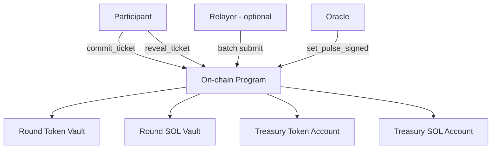
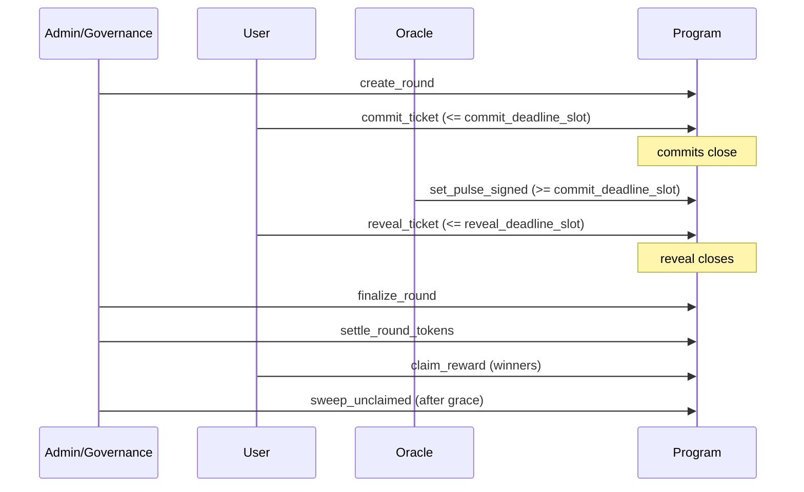

# Protocol Overview

TIMLG is a **verifiable time‑log protocol**: participants commit during a commit window, an oracle publishes a public randomness pulse after commits close, participants reveal their guess, and the program settles outcomes.

This documentation is **public** and intentionally avoids operational or privileged details.

!!! warning "Security principle"
    Public documentation must never include anything that enables unauthorized signing, authority changes, or treasury movement.

---

## Architecture (high level)

---

## Roles

- **Participant**: commits a ticket, later reveals it.
- **Relayer (optional)**: batches commits/reveals and submits them on‑chain.
- **Oracle**: provides a **pulse** (64 bytes / 512 bits) tied to a publicly verifiable source.
- **On-chain program**: enforces timing, verifies commit/reveal consistency, and settles.

---

## Core objects (MVP implementation)

### Round

A **Round** defines:

- `round_id`
- `pulse_index_target`
- `commit_deadline_slot` and `reveal_deadline_slot`
- `pulse` (set once after commits close)
- lifecycle flags: `pulse_set`, `finalized`, `token_settled`, `swept`

### Ticket

A **Ticket** binds a participant to a single commit:

- `round_id`, `user`, `nonce`
- `commitment` (32 bytes)
- `bit_index` (0–511), derived from `(round_id, user, nonce)`
- `revealed`, `guess` (0 or 1), and `win`
- `claimed` guard for rewards

---

## Lifecycle (happy path)

### Key invariants

- **Commitments are immutable**: a reveal must match the commitment.
- **Pulse is one-shot**: a round’s pulse can only be set once.
- **Timing gates are enforced** by slots.
- **Settlement gates claiming**: claim happens only after token settlement.

---

## Where to go deeper

- **Log Format** → canonical hashing and commitment rules, message formats, versioning
- **Timing Windows** → slot-based windows and edge cases
- **Settlement Rules** → how winners/losers/no-reveal are handled
- **Tokenomics** → how the MVP distributes and accounts for value
- **Treasury & BitIndex** → treasury flows and how bit indexes are derived
