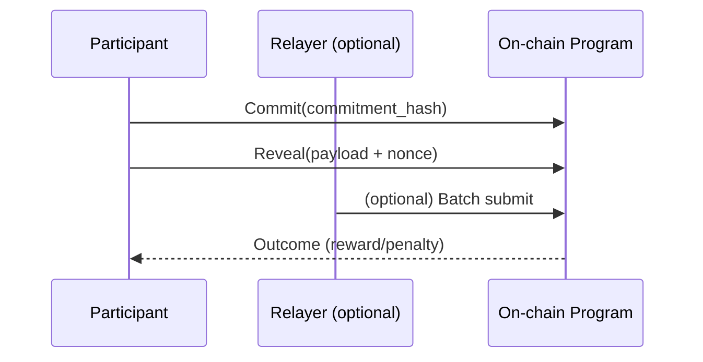

# Protocol Overview

TIMLG is a protocol for **verifiable time-logs** that supports reproducible coordination and deterministic settlement.

## Core ideas
- **Commit–reveal:** reduces copying and enables delayed disclosure
- **Deterministic settlement:** protocol rules decide outcomes without “hand-waving”
- **Auditability:** logs and outcomes can be inspected and compared

## Roles (conceptual)
- **Participants:** create time-logs (claims)
- **Relayer (optional):** batches transactions to improve UX
- **Oracle (off-chain):** provides deterministic public inputs (when required)
- **Program:** verifies rules and settles state
- **Treasury:** funds incentives and sustainability

## Minimal flow

!!! warning "Public vs private"
    This repo is public documentation.  
    Do not publish private keys, signer infrastructure, endpoints, or privileged automation scripts.

## Next steps for this spec
- Define the **log format** (fields + canonical hashing)
- Define **timing windows** and edge cases
- Define **settlement rules** and invariants
