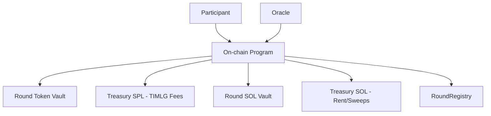

# Protocol Overview

TIMLG (TimeLog) is a **verifiable time-log protocol** and metrology experiment: users commit during a commit window, an oracle publishes a public randomness pulse (sourced from the **NIST Randomness Beacon v2.0**) after commits close, users reveal their guess, and the program settles outcomes deterministically.

This documentation is **public** and intentionally avoids operational or privileged details.

!!! warning "Security principle"
    Public documentation must never include anything that enables unauthorized signing, authority changes, or treasury movement.

!!! note "Stability vs versioning"
    The **core concept** is stable (commit–reveal against a publicly verifiable 512-bit pulse; deterministic settlement with WIN/LOSE/NO-REVEAL).
    Some **protocol surfaces** may still evolve while moving from localnet → devnet/mainnet readiness. If they change, they will be **explicitly versioned** (e.g., v1 → v2) to preserve auditability for indexers and independent verifiers.
    Examples: signed message domain separators, relayer/gasless flows, authority hardening (multisig/rotation), and sweep/claim semantics.

---

## Architecture (high level)

!!! note "MVP vs optional components"
    In the current MVP, the **core user flow** is user-paid commit → reveal → (win) claim.
    Relayer/batched flows exist as an optional design surface and may require additional on-chain/off-chain plumbing.

---

## Roles

- **Participant**: commits a ticket, later reveals it, and (if winning) claims.
- **Oracle**: publishes a **pulse** (64 bytes / 512 bits) tied to a publicly verifiable source (**NIST Randomness Beacon v2.0**) and verified on-chain. This provides **metrological traceability** for the protocol's randomness.
- **Admin/Governance**: creates rounds and executes admin-gated lifecycle steps (finalize, settle, optional sweep).
- **Relayer (optional)**: submits transactions on behalf of users (batching/gasless patterns).  
  **Note:** “gasless” typically still requires the user to have pre-funded an on-chain mechanism (e.g., escrow) depending on implementation.

---

## Core components (Professional Implementation)

### Global Configuration (`Config`)

The **Config** account defines deployment‑wide parameters and enforces protocol‑level guardrails.

| Parameter | Type | Description |
|---|---|---|
| `admin` | Pubkey | Governing authority for admin‑gated instructions. |
| `timlg_mint`| Pubkey | TIMLG SPL token mint (SPL‑2022). |
| `stake_amount` | u64 | Fixed cost per ticket (default: 1 000 000 000 base units). |
| `treasury` | Pubkey | SPL‑token vault for fee collection (`reward_fee_pool`). |
| `treasury_sol` | Pubkey | System PDA for lamport collection (SOL service fees/rent). |
| `claim_grace_slots` | u64 | Window before unclaimed rewards can be swept (default: 900). |
| `sol_service_fee` | u64 | Fee in lamports charged per ticket (configurable). |

### Timing Parameters (Slot-Bound Windows)

TIMLG operates on a strict slot‑based schedule to maintain the integrity of the randomness pulse.

| Setting | Default Value | Description |
|---|---|---|
| `COMMIT_WINDOW` | 1000 slots | Window during which users can submit commitments. |
| `REVEAL_WINDOW` | 1000 slots | Window during which users must reveal their guesses. |
| `MIN_REVEAL_WINDOW`| 60 slots | Minimum duration required for the reveal phase. |
| `REFUND_TIMEOUT` | 150 slots | Deadline for oracle pulse submission before refunding. |
| `CLAIM_GRACE` | 900 slots | Delay after settlement before sweeping unclaimed funds. |

### Oracle Architecture

The randomness pulse is provided by a set of authorized oracles.
- **Oracle Set**: Maximum of 16 authorized public keys.
- **Threshold**: Configurable minimum number of signatures required (default: 1).
- **Validation**: All pulse submissions are verified on‑chain via Ed25519 instructions, ensuring that the **auditability of infrastructure** is preserved against malicious oracle behavior. The pulse data adheres to the **NIST Interoperable Randomness Beacon** standards.

---

## Lifecycle (Standard Flow)

### 1. Initialization & Timing
Rounds are created with pre‑defined slot deadlines. The **Hawking Wall** is enforced by ensuring the commit window closes before the target pulse index is reached.

### 2. Participation (Commit-Reveal)
- **Commit**: The user pays the **stake (TIMLG)** and **service fee (SOL)**. A persistent `Ticket` PDA is created.
- **Pulse**: After the commit window closes, the Oracle publishes a 512‑bit pulse verified against a signed Ed25519 message.
- **Reveal**: Users submit their original choice and salt. The program verifies the commitment hash and determines the outcome based on the deterministic bit index.

### 3. Settlement & Rewards
- **Settle**: The round is finalized after the reveal window closes. This action triggers token accounting and enables claims.
- **Claim**: Winners receive their initial stake plus the minted reward (minus the protocol fee).
- **Sweep**: Unclaimed rewards in the round vault are transferred to the treasury after the `claim_grace_slots` period expires.

---

## Treasury Management

The protocol utilizes isolated vaults for risk management:
- **Round Vault (SPL)**: Escrows stakes and holds minted rewards until claim.
- **Reward Fee Pool (SPL)**: Receives protocol commission from winning rewards.
- **Treasury SOL**: PDA‑owned account collecting service fees and unclaimed rent/sweeps.

---

## Ticket Lifecycle States

Tickets transition through states defined in the on‑chain state machine:
- `PENDING`: Commitment submitted, waiting for pulse.
- `REVEAL_NOW`: Pulse published, reveal window active.
- `REVEALED`: Guess submitted, outcome pending settlement.
- `WIN`: Prediction correct, reward available.
- `BURN_LOSS`: Incorrect guess, stake transferred to burn address.
- `EXPIRED`: Reveal deadline missed, stake burned.
- `REFUND_AVAILABLE`: Oracle timeout reached, stake returnable.

---

## Ticket Closure (Rent Recovery)

Tickets are rent‑exempt PDAs. To recover the SOL deposit, the user must call the `close_ticket` instruction after the ticket has been fully processed (Claimed, Burned, or Refunded). The instruction closes the account and transfers the lamports back to the user.

---

## Ticket cleanup (rent)

Tickets are rent-exempt PDAs that hold a lamport deposit. After settlement (and after claim if you won), the owner can reclaim this SOL by calling `close_ticket`.
