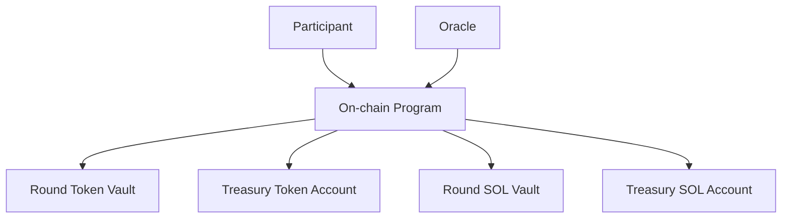

# Protocol Overview

TIMLG (TimeLog) is a **verifiable time-log protocol**: participants commit during a commit window, an oracle publishes a public randomness pulse after commits close, participants reveal their guess, and the program settles outcomes deterministically.

This documentation is **public** and intentionally avoids operational or privileged details.

!!! warning "Security principle"
    Public documentation must never include anything that enables unauthorized signing, authority changes, or treasury movement.

!!! note "Stability vs versioning"
    The **core concept** is stable (commit–reveal against a publicly verifiable 512-bit pulse; deterministic settlement with WIN/LOSE/NO-REVEAL).
    Some **protocol surfaces** may still evolve while moving from localnet → devnet/mainnet readiness. If they change, they will be **explicitly versioned** (e.g., v1 → v2) to preserve auditability for indexers and independent verifiers.
    Examples: signed message domain separators, relayer/gasless flows, authority hardening (multisig/rotation), and sweep/claim semantics.

---

## Architecture (high level)

!!! note "MVP vs optional components"
    In the current MVP, the **core user flow** is user-paid commit → reveal → (win) claim.
    Relayer/batched flows exist as an optional design surface and may require additional on-chain/off-chain plumbing.

---

## Roles

- **Participant**: commits a ticket, later reveals it, and (if winning) claims.
- **Oracle**: publishes a **pulse** (64 bytes / 512 bits) tied to a publicly verifiable source and verified on-chain.
- **Admin/Governance**: creates rounds and executes admin-gated lifecycle steps (finalize, settle, optional sweep).
- **Relayer (optional)**: submits transactions on behalf of users (batching/gasless patterns).  
  **Note:** “gasless” typically still requires the user to have pre-funded an on-chain mechanism (e.g., escrow) depending on implementation.

---

## Core objects (MVP implementation)

### Config (global)

The **Config** account defines deployment-wide parameters, including:

- `admin` (governing authority for admin-gated instructions)
- `mint` (TIMLG SPL token mint)
- `stake_amount` (integer, in mint base units; designed for decimals = 0 so `stake_amount = 1` means 1 TIMLG)
- treasury endpoints (token treasury account; SOL treasury account)
- timing knobs (e.g., claim grace slots)

!!! info "Whole-token unit (no decimals)"
    TIMLG is designed as a **whole-unit token** (`decimals = 0`) so that the base unit equals the user-facing unit.

### Round

A **Round** defines:

- `round_id`
- `pulse_index_target`
- `commit_deadline_slot` and `reveal_deadline_slot`
- `pulse` (set once after commits close)
- lifecycle flags: `pulse_set`, `finalized`, `token_settled`, `swept`

### Ticket

A **Ticket** binds a participant to a single commitment:

- `round_id`, `participant`, `nonce`
- `commitment` (32 bytes)
- `bit_index` (0–511), derived from `(round_id, participant, nonce)`
- reveal markers (`revealed`, `guess` as 0/1) and outcome (`win`)
- claim guards (`claimed`, `claimed_slot` or equivalent)

!!! note "Stake amount location"
    The stake amount is **not a per-ticket parameter** in the MVP; it is defined in the global **Config** and applied consistently to tickets in a round.

---

## Lifecycle (happy path)

1. Admin creates a round (`create_round`)
2. User commits (`commit_ticket`) during the commit window
3. Oracle publishes the pulse (`set_pulse_signed`) after commits close
4. User reveals (`reveal_ticket`) during the reveal window
5. Admin finalizes (`finalize_round`)
6. Admin settles token accounting (`settle_round_tokens`)
7. Winners claim (`claim_reward`)
8. Optionally, after the grace window, admin sweeps SOL (`sweep_unclaimed`, SOL-only)

### Key invariants

- **Commitments are immutable**: a reveal must match the commitment.
- **Pulse is one-shot**: a round’s pulse can only be set once.
- **Timing gates are enforced** by slots.
- **Settlement gates claiming**: claim happens only after token settlement.

---

## Where to go deeper

- **Log Format** → canonical hashing and commitment rules, message formats, versioning
- **Timing Windows** → slot-based windows and edge cases
- **Settlement Rules** → how winners/losers/no-reveal are handled
- **Tokenomics** → how the MVP distributes and accounts for value
- **Treasury & BitIndex** → treasury flows and how bit indexes are derived
