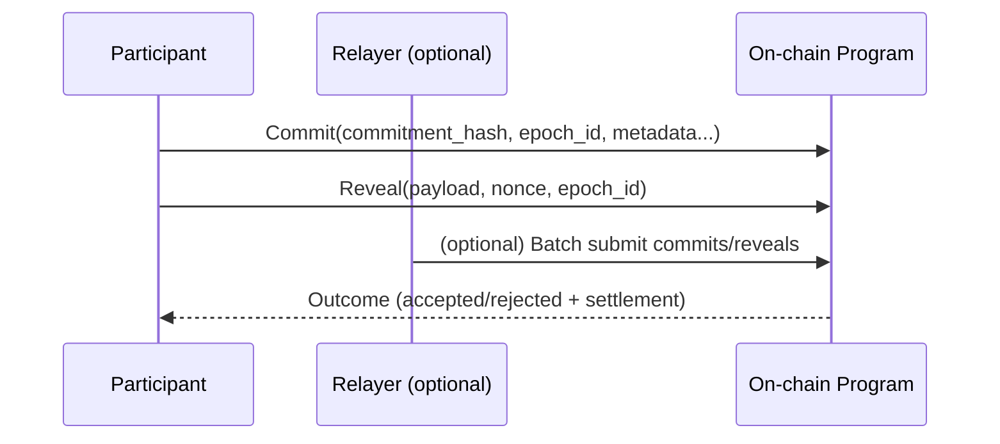

# Protocol Overview

TIMLG is a protocol for **verifiable time-logs** that supports **reproducible coordination** and **deterministic settlement**.

## At a glance

- **Commit → Reveal → Settle**: participants first commit to a claim, later reveal evidence, then the protocol settles outcomes.
- **Optional relayer**: improves UX by batching submissions (but doesn't change the rules).
- **Audit-friendly**: logs, timing, and outcomes are structured for verification and comparison.

!!! note "Docs-first public hub"
    This repository is the **public documentation site**.
    Operational details (keys, privileged configs, production oracle/relayer infrastructure) are intentionally not published here.

---

## Design goals

- **Reproducibility**: make it easy to compare outcomes across time and across participants.
- **Anti-copy / delayed disclosure**: enable participation without immediately leaking the full evidence.
- **Deterministic rules**: settlement should be explainable and consistent given the same inputs.
- **Composable incentives**: align participation and quality using transparent, rule-based economics.

---

## Conceptual components

- **Participants** produce time-logs (claims).
- **Relayer (optional)** batches transactions to reduce friction and fees.
- **Oracle (off-chain, optional)** provides deterministic public inputs when required (e.g., beacon values).
- **On-chain program** verifies commitments, validates reveals, and settles state.
- **Treasury** funds incentives and long-term sustainability.

```mermaid
flowchart TB
  P[Participant] -->|Commit| S[(On-chain Program)]
  P -->|Reveal| S
  R[Relayer (optional)] -->|Batch submits| S
  O[Oracle inputs (optional)] -->|Deterministic values| S
  S --> T[Treasury / Incentives]
  S --> I[Indexes / Metrics]
```

---

## Core primitives (high level)

- **Epoch**: a time window used for coordination (e.g., “day”, “round”, or any configured duration).
- **Commitment**: a hash that commits to a future reveal without disclosing it immediately.
- **Reveal payload**: evidence + metadata (structured, canonical format).
- **Outcome**: settlement result (e.g., valid/invalid + reward/penalty + metrics updates).

!!! tip
    The precise structures live in the spec pages:
    **Log Format**, **Timing Windows**, and **Settlement Rules**.

---

## Minimal flow



---

## What this page intentionally does *not* include

- Private keys, signers, or privileged operational details
- “Production” oracle infrastructure (endpoints, automation)
- Anything that could enable unauthorized control or fund movement

!!! warning "Security principle"
    Public documentation must never include anything that enables unauthorized signing, authority changes, or treasury movement.

---

## Next: where to go deeper

- **Log Format** → canonical fields, hashing/commitment approach, versioning
- **Timing Windows** → epoch definition, commit/reveal windows, edge cases
- **Settlement Rules** → acceptance criteria, outcomes, invariants and failure modes
