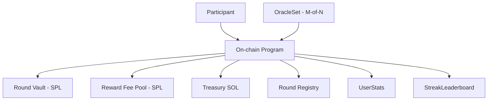

# Protocol Architecture Overview

| Metadata | Reference |
|---|---|
| **Document ID** | TP-SPEC-001 |
| **Status** | Approved (Devnet MVP) |
| **Authority** | Richard David Martín |

TIMLG is a slot-bounded commit-reveal protocol tied to a publicly verifiable 512-bit randomness pulse
(NIST Beacon Chain 2). Participants commit during the commit window, an authorized oracle set publishes
a signed pulse after commit closes, participants reveal their guess, and the program settles outcomes
deterministically.

This documentation is public and intentionally excludes operational secrets, signer custody details,
and any material that would weaken authority safety.

---

## Current implementation boundary

| Topic | Current Devnet MVP | Future hardening |
|---|---|---|
| Oracle model | OracleSet quorum (M-of-N Ed25519) with on-chain NIST chaining (`output_value` + precommitment). Single-signer fallback exists but is disabled for betting rounds. | zkTLS or equivalent NIST-binding proof; expanded oracle set governance |
| Round creation | Permissionless, gated by an on-chain canonical-target rule (`create_round_permissionless`) | Same model; admin governance only over fee / window caps |
| User flow | User-paid commit, reveal, claim, plus signed batches (`commit_batch_signed`, `reveal_batch_signed`) | Public relayer infrastructure |
| Ticket outcome model | WIN, LOSE, NO-REVEAL, REFUND | Stable unless explicitly versioned |
| Wallet-level analytics | `UserStats` counters, longest streak, current streak, refund-window counter | Expanded campaign logic / leaderboards |
| Streak incentive | `StreakLeaderboard` + `claim_streak_jackpot` (active) | Multi-tier ranking, seasonal contests |
| Recovery | Proof-gated `enter_recovery_mode` + `install_nist_anchor_quorum` + `exit_recovery_mode` | Same flow with broader oracle set |

---

## High-level architecture

```mermaid
graph TD
  P[Participant] --> S[On-chain Program]
  OS[OracleSet - M-of-N] --> S
  S --> RV[Round Vault - SPL]
  S --> RFP[Reward Fee Pool - SPL]
  S --> TSOL[Treasury SOL]
  S --> RR[Round Registry]
  S --> US[UserStats]
  S --> LB[StreakLeaderboard]
```

---

## Roles

| Role | Responsibility |
|---|---|
| **Participant** | Commits a ticket, later reveals, and claims if the ticket wins; can also claim the streak jackpot when eligible |
| **Oracle (member of OracleSet)** | Independently fetches NIST and signs the canonical pulse / anchor message; quorum is verified on-chain |
| **Admin / Governance** | Bootstrap (config, oracle set, leaderboard), parameter caps, recovery exit, treasury withdrawal |
| **Relayer (any actor)** | Permissionless: assembles a quorum of signatures and submits `set_pulse_quorum`, `install_nist_anchor_quorum`, or creates rounds via `create_round_permissionless` |

---

## Core protocol surfaces

| Surface | Type | Purpose |
|---|---|---|
| **Config** | PDA | Global parameters, authority references, NIST chaining anchor (`last_output_value`, `last_precommitment_value`), recovery state |
| **Tokenomics** | PDA | Reward fee configuration and treasury routing parameters |
| **OracleSet** | PDA | Allowlist of oracle public keys and quorum threshold |
| **RoundRegistry** | PDA | Global round indexing and `last_created_target` for canonical-target enforcement |
| **Round** | PDA | One round's timing, pulse, settlement state, and `kind` (Betting or Continuity) |
| **RoundTargetRecord** | PDA | One-shot dedup record per `pulse_index_target` (prevents two rounds racing on the same target) |
| **Ticket** | PDA | One user participation record, including monotonic `user_commit_index` |
| **UserStats** | PDA | Wallet-level participation counters and streak tracking |
| **UserEscrow** | PDA | Optional pre-funded balance for relayed / batched flows |
| **StreakLeaderboard** | PDA | Singleton record of the current global streak record holder |
| **OracleAttestationRecord** | PDA | One-shot attestation receipt per (round, oracle); stores signature + NIST output for board reconstruction |
| **OracleAnchorAttestationRecord** | PDA | Same idea but for anchor recovery attestations |
| **Round Vault / TIMLG Vault** | Token account / system-owned PDA | Round-level escrow and routing surface |
| **Reward Fee Pool** | Token account | Receives fee on winning rewards |
| **Treasury SOL** | PDA / system surface | Receives `sol_service_fee_lamports` per ticket — funds the streak jackpot pool |
| **Treasury SPL (TIMLG)** | Token account | Receives swept token residue |

For derivation patterns and ownership boundaries, see [PDAs and Accounts](pdas_and_accounts.md).
For counter semantics and streak rules, see [User Statistics](user_stats.md).
For the streak jackpot, see [Streak Jackpot](streak_jackpot.md).

---

## Canonical lifecycle

| Step | What happens | Primary state surfaces |
|---|---|---|
| 1. Round creation | Anyone calls `create_round_permissionless(target)`; the program enforces `target == max(last_created_target + 1, LFP + min_future_pulses)` | `Round`, `RoundRegistry`, `RoundTargetRecord` |
| 2. Commit | User stake is escrowed and a ticket is created with a deterministic `bit_index` | `Ticket`, round vault, `UserStats` (commit counter) |
| 3. Pulse publication | Oracles independently sign the canonical message; a relayer assembles M-of-N signatures and calls `set_pulse_quorum` | `Round`, `Config` (NIST chain advances), `OracleAttestationRecord` |
| 4. Reveal | User reveals guess + salt; commitment is checked, outcome is classified, streak counters update | `Ticket`, `UserStats` |
| 5. Settle | `settle_round_tokens` burns LOSE and NO-REVEAL stake; winning tickets become claimable | `Round`, round vault |
| 6. Claim | Winner claims stake refund plus minted reward, minus protocol fee | `Ticket`, `UserStats`, `Reward Fee Pool` |
| 7. Sweep / refund / close | Cleanup and fallback flows run according to policy | `Round`, `Ticket`, treasuries |
| 8. (Optional) Jackpot claim | If `current_streak > record_streak`, user calls `claim_streak_jackpot` | `StreakLeaderboard`, `UserStats`, `Treasury SOL` |

---

## Why `UserStats` matters in the architecture

A protocol that is serious about observability should document wallet-level state as clearly as round-level state.
`UserStats` exists for that reason and now also gates the streak jackpot.

| Capability | Why it is useful |
|---|---|
| Participation counters | Compact, auditable summary of wallet activity |
| Win/loss ratios | Supports analytics without scanning every historical ticket |
| Current and longest streak | Required input for the on-chain streak jackpot eligibility rule |
| `refunded_in_streak_window` | Lets refund "hops" (rounds without a pulse) coexist with streaks without breaking them |

!!! note "Important boundary"
    `UserStats` is **not** a reward vault. It holds counters, not funds. The actual jackpot lamports
    live in the Treasury SOL PDA and are released only by `claim_streak_jackpot` after the on-chain
    record-breaking check.

---

## Treasury model in one table

| Surface | Current role |
|---|---|
| **Round Vault (SPL)** | Holds escrowed stake and post-settlement token routing surface |
| **Reward Fee Pool (SPL)** | Receives the configured fee fraction of winning rewards |
| **Treasury SPL** | Receives swept residual TIMLG from rounds whose grace expired |
| **Treasury SOL** | Receives `sol_service_fee_lamports` per ticket and funds the streak jackpot |

---

## Versioning principle

The protocol concept is stable. If any of the following changes, documentation should treat it as a
versioned surface rather than a silent reinterpretation:

- signed message envelope format (`commit_v1`, `reveal_v1`, `pulse_v1`, anchor quorum messages)
- oracle model (set, threshold, NIST chaining)
- treasury routing semantics
- bitIndex derivation formula
- `UserStats` field semantics
- streak jackpot eligibility rules
- recovery-mode entry / exit conditions
