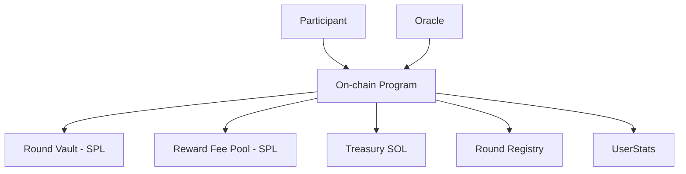

# Protocol Architecture Overview

| Metadata | Reference |
|---|---|
| **Document ID** | TP-SPEC-001 |
| **Status** | Approved (Devnet MVP) |
| **Authority** | Richard David Martín |

TIMLG is a slot-bounded commit-reveal protocol tied to a public 512-bit randomness pulse.
Participants commit during the commit window, an authorized oracle publishes the pulse after commit closes,
participants reveal their guess, and the program settles outcomes deterministically.

This documentation is public and intentionally excludes operational secrets, signer custody details,
and any material that would weaken authority safety.

---

## Current implementation boundary

| Topic | Current Devnet MVP | Future hardening |
|---|---|---|
| Oracle model | Single authorized signer, on-chain Ed25519 verification | Oracle-set / threshold-based model |
| User flow | User-paid commit, reveal, claim | Relayed / batched participation |
| Ticket outcome model | WIN, LOSE, NO-REVEAL, REFUND | Stable unless explicitly versioned |
| Wallet-level analytics | `UserStats` counters and streaks | Expanded campaign logic / leaderboards |
| Incentive campaigns | Not part of core settlement | Separate streak or leaderboard reward modules |

---

## High-level architecture

```mermaid
graph TD
  P[Participant] --> S[On-chain Program]
  O[Oracle] --> S
  S --> RV[Round Vault - SPL]
  S --> RFP[Reward Fee Pool - SPL]
  S --> TSOL[Treasury SOL]
  S --> RR[Round Registry]
  S --> US[UserStats]
```

---

## Roles

| Role | Responsibility |
|---|---|
| **Participant** | Commits a ticket, later reveals, and claims if the ticket wins |
| **Oracle** | Publishes a signed pulse tied to a publicly verifiable randomness source |
| **Admin / Governance** | Creates rounds and executes admin-gated lifecycle operations |
| **Relayer (optional)** | Future surface for batching or sponsored flows |

---

## Core protocol surfaces

| Surface | Type | Purpose |
|---|---|---|
| **Config** | PDA | Global parameters and authority references |
| **Tokenomics** | PDA | Reward fee configuration and treasury routing parameters |
| **RoundRegistry** | PDA | Global round indexing |
| **Round** | PDA | One round's timing, pulse, and settlement state |
| **Ticket** | PDA | One user participation record |
| **UserStats** | PDA | Wallet-level participation counters and streak tracking |
| **Round Vault** | Token account / PDA authority | Escrow and token routing surface |
| **Reward Fee Pool** | Token account | Receives fee on winning rewards |
| **Treasury SOL** | PDA / system surface | Lamport collection surface |

For derivation patterns and ownership boundaries, see [PDAs and Accounts](pdas_and_accounts.md).
For counter semantics, see [User Statistics](user_stats.md).

---

## Canonical lifecycle

| Step | What happens | Primary state surfaces |
|---|---|---|
| 1. Round creation | Admin creates a round with slot deadlines and target pulse metadata | `Round`, `RoundRegistry` |
| 2. Commit | User stake is escrowed and a ticket is created | `Ticket`, round vault |
| 3. Pulse publication | Oracle publishes the signed pulse after commit closes | `Round` |
| 4. Reveal | User reveals guess + salt; commitment is checked and outcome is classified | `Ticket`, `UserStats` |
| 5. Settle | Losers and no-reveals are burned; winning tickets become claimable after settlement | `Round`, round vault |
| 6. Claim | Winner claims stake refund plus minted reward, minus protocol fee if configured | `Ticket`, `UserStats`, `Reward Fee Pool` |
| 7. Sweep / refund / close | Cleanup and fallback flows run according to policy | `Round`, `Ticket`, treasuries |

---

## Why `UserStats` matters in the architecture

A protocol that is serious about observability should document wallet-level state as clearly as round-level state.
`UserStats` exists for that reason.

| Capability | Why it is useful |
|---|---|
| Participation counters | Gives a compact, auditable summary of wallet activity |
| Win/loss ratios | Supports analytics without scanning every historical ticket |
| Current and longest streak | Enables deterministic leaderboard-style evaluation |
| Future campaign integration | Provides a clean input for streak-based reward modules without changing settlement rules |

!!! note "Important boundary"
    `UserStats` is **not** a reward vault and **not** a replacement for ticket-level verification.
    It is an aggregated observability surface.

---

## Treasury model in one table

| Surface | Current role |
|---|---|
| **Round Vault (SPL)** | Holds escrowed stake and post-settlement token routing surface |
| **Reward Fee Pool (SPL)** | Receives configured fee from winning rewards |
| **Treasury SOL** | Receives service fees and selected lamport cleanup flows |

---

## Versioning principle

The protocol concept is stable. If any of the following changes, documentation should treat it as a versioned surface rather than a silent reinterpretation:

- signed message envelope format
- oracle model
- treasury routing semantics
- bitIndex derivation formula
- `UserStats` field semantics
- future streak-reward eligibility rules
