# Protocol Parameters

This page documents **slot-based timing** and **deployment parameters** for TIMLG.
It includes:
- a **timeline diagram** (slots),
- a **Devnet** table (current supervisor + on-chain settings),
- a **Mainnet** table (planned / longer windows).

> **Important:** The program enforces gates using **Solana slots** and per-round deadlines (`commit_deadline_slot`, `reveal_deadline_slot`).
> The operator/supervisor creates rounds by choosing those deadlines (subject to on-chain validation).

---

## Round timeline (slots)

The protocol phases are gated by **slots** (not wall-clock seconds). The diagram below is an **example round** that matches the
current Devnet supervisor defaults and a typical claim grace configuration.

- Example commit window uses the **Devnet cap** (≈7 minutes).
- Reveal window commonly uses **`DEFAULT_REVEAL_WINDOW_SLOTS = 1000`**.
- Claim grace is a **Config parameter** (`claim_grace_slots`). The program default is **`DEFAULT_CLAIM_GRACE_SLOTS = 900`**.
- Refund eligibility is shown for the **oracle-failure path** (no pulse ever set).

```mermaid
gantt
    title Round Timeline (X-Axis = Slots)
    dateFormat  X
    axisFormat  %s

    section PHASE 1<br/>Commit
    Commit window                 : c, 0, 919
    Commit (user)                 : done, milestone, mCommit, 460, 460

    section Pulse<br/>(NIST + oracle)
    Pulse-set lag                 : lag, 919, 1414
    Pulse set on-chain            : active, milestone, mPulse, 1414, 1414

    section PHASE 3<br/>Reveal
    Reveal window                 : r, 919, 1919
    Reveal (user)                 : done, milestone, mReveal, 1500, 1500

    section PHASE 4<br/>Finalize / Settle
    Settle (observed)             : crit, milestone, mSettle, 1959, 1959

    section PHASE 5<br/>Claim / Sweep
    Claim grace window            : g, 1919, 2819
    Claim (user)                  : done, milestone, mClaim, 2300, 2300
    Sweep (action)                : crit, milestone, mSweep, 2819, 2819

    section Oracle failure<br/>(no pulse)
    Refund available (gate)       : active, milestone, mRefundGate, 2069, 2069
    Refund window (∞)             : ref, 2069, 3200
    Refund (user/anyone)          : done, milestone, mRefundAct, 2150, 2150
```

  
Legend (diamond colors / responsibility)

  

    
◆ <b>User</b>

    
◆ <b>Oracle / Gate</b>

    
◆ <b>Operator / Admin</b>

  

!!! note "About the action diamonds"
    The **Commit / Reveal / Claim** diamonds are illustrative examples of when a user might act inside each window.
    They are not fixed deadlines: a user may commit/reveal/claim at any time while the corresponding phase is open.

!!! note "Claim grace ≠ “time to claim”"
    `claim_grace_slots` is the minimum guarantee before `sweep_unclaimed` becomes eligible.
    Claim remains possible until a sweep is actually executed on-chain and sets `round.swept = true`.

!!! note "Refund window (oracle failure)"
    Refund becomes available only if no pulse is ever set (`pulse_set = false`).
    Once available, refunds can be triggered at any later time (owner: `recover_funds`, or permissionless: `recover_funds_anyone`).
    The diagram draws an “∞” window as a long bar for readability.

!!! note "Refund marker"
    Refund only applies when **no pulse is ever set** (`pulse_set = false`). In that failure path, the normal claim flow is not used.

---

## Devnet operator entrypoints (timing)

## Devnet operator entrypoints (timing)

The Devnet environment runs a standard **Oracle Operator** configuration which you can replicate using the provided infrastructure.

- **Standard Oracle Mode (NIST):**
  - Creates rounds in **`ROUND_SCHEDULER_MODE=nist`**.
  - **Commit window is dynamic** (derived from "time until pulse deadline", capped by `COMMIT_DURATION_SEC`).
  - Reveal window is fixed by `REVEAL_WINDOW_SLOTS` (default **1000**).

> **Note:** The timeline and tables below assume these standard NIST defaults.

---

## Devnet parameters (current)

These values reflect **how Devnet is running right now** using the standard NIST configuration and the currently observed on-chain config behavior.

### Timing & scheduling

| Parameter | Devnet value | Notes |
|---|---:|---|
| Round scheduler mode | `nist` | Rounds target NIST pulse indices. |
| NIST pulse offset | `1` | Target is offset from “current” NIST pulse. |
| Pipeline depth | `7` | Supervisor keeps ~7 upcoming rounds “in flight”. |
| Commit duration cap | `420 sec` | Commit window is **variable** in NIST mode, capped at 420s. |
| Commit window (slots) | ~150–1050 slots | Derived from time-until-target pulse using ~0.40s/slot approximation. |
| Reveal window | `1000 slots` | Supervisor sets `reveal_deadline = commit_deadline + 1000`. |
| Claim grace | `claim_grace_slots` (default `900`) | Canonical value is stored on-chain in `Config`. The supervisor may use a shorter local *precheck* before attempting sweeps, but the program enforces the real grace gate. |
| Refund timeout | `150 slots` | On-chain constant `REFUND_TIMEOUT_SLOTS = 150`. |
| Late pulse safety buffer | `50 slots` | On-chain constant `LATE_PULSE_SAFETY_BUFFER_SLOTS = 50` (pulse rejected if too close to reveal deadline). |
| Operator tick | `5 sec` | Supervisor loop frequency (`OPERATOR_TICK_SEC`). |

> [!TIP]
> Technical constants and safety buffers are defined in the on-chain [constants.rs](https://github.com/richarddmm/timlg-protocol/blob/main/programs/timlg_protocol/src/constants.rs) file.

### Economics (Devnet MVP)

| Parameter | Devnet value | Notes |
|---|---:|---|
| Stake per ticket | `stake_amount` (u64) | Stake is stored in **base units**. Devnet UI typically uses `stake_amount = 1` with a mint that may have `decimals = 0`, but decimals are a deployment choice. |
| Reward fee | `reward_fee_bps` (default 100 = 1%) | Fee applies to minted reward; routed to Reward Fee Pool. |

!!! note "Wall-clock time vs slots"
    Slots vary with cluster conditions. The supervisor uses a fixed approximation (~0.40s/slot) to compute deadlines in NIST mode,
    but the program itself only enforces **real slots** recorded on-chain.

---

## Mainnet parameters (planned)

Mainnet values will be tuned for real users and reliable claim behavior across time zones.
Exact numbers are **TBD** until final launch config is published.

| Parameter | Mainnet policy (planned) | Why |
|---|---|---|
| Commit duration | Longer than Devnet | More time for participation and network variance. |
| Reveal window | Longer than Devnet | Reduce accidental NO-REVEAL outcomes. |
| Claim grace | Significantly longer (hours/days) | Users should not need to monitor constantly. |
| Refund timeout | Stable + announced | Clear oracle-failure policy. |
| Fees | Stable + announced | Predictable economics. |
| Scheduler mode | `nist` (likely) | Matches the public randomness cadence. |

---

## Technical phase gating (conceptual)

| Phase | Gate (simplified) | Allowed actions |
|---|---|---|
| Commit | `slot <= commit_deadline` and `!pulse_set` and `!finalized` | commit instructions |
| Pulse publication | `slot >= commit_deadline` and `!pulse_set` | `set_pulse_signed` |
| Reveal | `pulse_set` and `slot <= reveal_deadline` and `!finalized` | reveal instructions |
| Finalize / Settle | `slot > reveal_deadline` and `pulse_set` | finalize / settle |
| Claim | `token_settled` and `!swept` | `claim_reward` |
| Close ticket (rent) | If round alive: `ticket.processed` and (if winner) `ticket.claimed`; if round archived: `round.lamports()==0` | `close_ticket` |
| Sweep | `slot > reveal_deadline + claim_grace_slots` | `sweep_unclaimed` (round vault SOL + remaining SPL; does not close user tickets) |
| Refund (oracle failure) | `!pulse_set` and `slot > reveal_deadline + REFUND_TIMEOUT_SLOTS` | `recover_funds`, `recover_funds_anyone` |