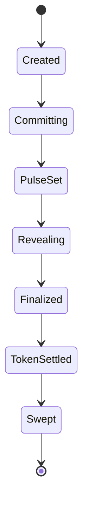

# Settlement Rules (Spec)

This page specifies how outcomes are determined and how funds/tokens move **conceptually**.
It matches the MVP on-chain behavior at a high level.

## Round state machine (MVP)

---

## Outcome determination

Given:

- a ticket with `(round_id, user, nonce, commitment)`
- a pulse `pulse[64]`
- the derived `bit_index ∈ [0..511]`

A reveal provides `(guess ∈ {0,1}, salt[32])` and is valid if:

1. `commit_hash(round_id, user, nonce, guess, salt) == commitment`
2. `derived_bit_index(round_id, user, nonce) == ticket.bit_index`
3. `pulse is set` for the round
4. reveal happens within the reveal window

Then:

- `pulse_bit = get_pulse_bit(pulse, bit_index)`
- `win = (pulse_bit == guess)`

---

## Settlement phases (MVP implementation)

TIMLG separates settlement into **two layers**:

1. **Truth settlement** (deterministic): establish `win/lose` per ticket from the pulse bit.
2. **Economic settlement** (MVP): apply rules for rewards and penalties using vaults.

### Phase 0 — Commit stake

On commit:

- a ticket is created
- the user pays a stake into the round’s SOL vault (system-owned PDA)

### Phase 1 — Finalization gate

A round becomes finalizable only if:

- pulse is set, and
- reveal window has ended

### Phase 2 — Token settlement gate (required before claim)

Token settlement runs once the round is finalized.

Conceptual rules in MVP:

- **Losers**: per-ticket allocation is **burned** from the round token vault.
- **No-reveal**: per-ticket allocation is transferred to the **treasury token account**.
- Round is marked `token_settled = true` once complete.

### Phase 3 — Claiming (winners only)

A user can claim only if:

- round is `token_settled`
- ticket was revealed
- ticket is a winner
- claim is before a sweep occurs

When claiming (MVP):

- transfers `stake_amount` tokens from the round token vault to the user
- mints an additional `stake_amount` tokens to the user

### Phase 4 — Sweeping unclaimed SOL

After a grace period, remaining SOL in the round vault can be swept to a treasury SOL account.

---

## Safety properties

- **No early claim**: winners cannot claim before `token_settled`.
- **No double settlement**: settlement uses guards to prevent duplicates.
- **No double claim**: each ticket can be claimed at most once.
