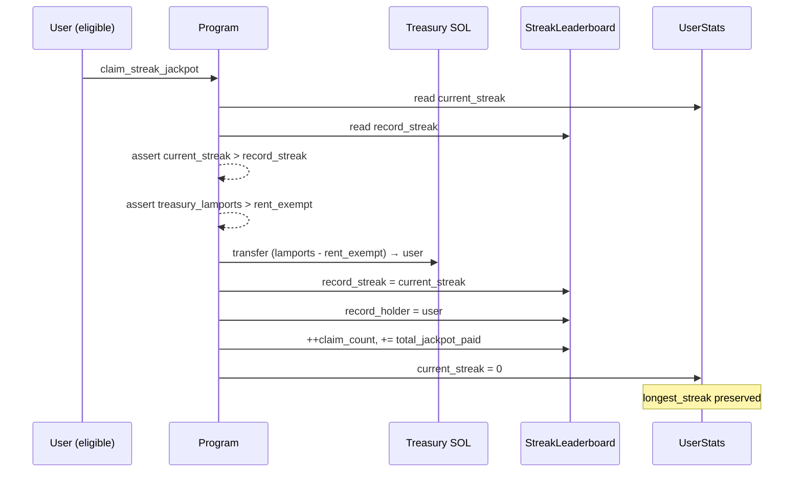

# Streak Jackpot

| Metadata | Reference |
|---|---|
| **Document ID** | TP-ECON-003 |
| **Status** | Implemented in the Devnet MVP |
| **Scope** | On-chain streak record, jackpot pool, and claim mechanic |

The Streak Jackpot is a **public, fully on-chain** incentive layer that pays out the entire SOL pool
accumulated from per-ticket service fees to whoever **breaks the on-chain streak record**. It is
additive to the core round lifecycle: if it were never claimed, ticket settlement would behave
identically.

---

## 1. Funding source

| Surface | Role |
|---|---|
| `Config.sol_service_fee_lamports` | Per-ticket SOL fee charged at every commit |
| `Treasury SOL` PDA | Lamport accumulator that holds the active jackpot |

Every successful commit (`commit_ticket`, `commit_batch`, `commit_batch_signed`) transfers
`sol_service_fee_lamports` from the user's wallet to the Treasury SOL PDA. There is no other source.

---

## 2. The on-chain record

The `StreakLeaderboard` PDA is a singleton:

| Field | Meaning |
|---|---|
| `record_streak` | Highest streak ever verified and claimed |
| `record_holder` | Pubkey of the current record holder (default if never claimed) |
| `record_set_slot` | Slot at which the current record was set |
| `last_claim_slot` | Slot of the last jackpot claim |
| `total_jackpot_paid` | Cumulative lamports paid out historically (audit) |
| `claim_count` | How many times the jackpot has been claimed |

Initialised once by the admin (`initialize_streak_leaderboard`); after that the protocol manages it
exclusively through `claim_streak_jackpot`.

---

## 3. Eligibility rule

```
claim_streak_jackpot succeeds  ⇔  user_stats.current_streak > leaderboard.record_streak
```

`current_streak` is computed by the protocol itself during reveal classification — see
[User Statistics](user_stats.md) for the rules. The streak is anchored to a monotonic
`user_commit_index` and tolerates legitimate refund hops via `refunded_in_streak_window`.

---

## 4. Claim flow



Important properties:

- The full pool above the rent-exempt minimum is delivered in one transfer.
- After a successful claim, `current_streak` is reset to `0` so the same user must build a new streak
  to claim again.
- `longest_streak` is **not** reset — it is the user's personal historical record.
- `record_holder` is updated to the claimer.

---

## 5. Audit counters

`StreakLeaderboard.total_jackpot_paid` and `claim_count` are pure audit fields. Public dashboards
and the Live Audit surface can use them without scanning historical transactions.

---

## 6. Anti-grinding properties

| Attack vector | Why it fails |
|---|---|
| **Hide losing reveals to fake a high streak** | A WIN only extends the streak when `user_commit_index == last_revealed_winning_index + 1 + refunded_in_streak_window`. Skipping a loser breaks index continuity → the next WIN resets the streak |
| **Fake refund "hops" to skip a loser** | `recover_funds` requires `!round.pulse_set` (oracle failure path); refunds cannot be triggered against a round that received a pulse |
| **Front-run a claim** | The user is `Signer` and `user_stats` has `has_one == user`; the program rejects any caller that is not the owner |
| **Drain rent-exempt lamports of the PDA** | Payout is computed as `lamports - rent.minimum_balance(0)`; rent reserve is preserved |
| **Double-claim** | After a successful claim, `current_streak == 0`. Any next claim must build a new streak that exceeds the **new** record (which is at least as high as the just-claimed streak) |
| **Inflate `longest_streak` artificially** | Eligibility uses `current_streak`, not `longest_streak`. `longest_streak` is a personal metric only |

---

## 7. Failure modes

| Error | Meaning |
|---|---|
| `StreakDoesNotBeatRecord` | `current_streak <= record_streak` — claim rejected |
| `JackpotEmpty` | Treasury SOL has no lamports above the rent-exempt minimum |
| `LeaderboardNotInitialized` | The admin has not yet called `initialize_streak_leaderboard` |
| `Unauthorized` | The signer is not the owner of `user_stats` |

---

## 8. Authority domain

| Action | Domain | Caller |
|---|---|---|
| `initialize_streak_leaderboard` | Admin (one-shot) | Config admin |
| `update_sol_service_fee` | Admin (parameter change) | Config admin |
| `claim_streak_jackpot` | User | The owner of the eligible `UserStats` |
| Read leaderboard for display | Public | Any client (supervisor, ticket-manager-sdk, audit, beta app) |

The off-chain Supervisor never claims, never signs, and never assembles consensus around the jackpot.
Eligibility and execution happen on-chain.

---

## 9. What this page does not claim

- That participating in TIMLG is a financial product or a security.
- That the jackpot is guaranteed to be non-empty at any point — the pool is just the accumulated fees
  since the last claim.
- That the jackpot mechanic alters ticket settlement. It does not.
