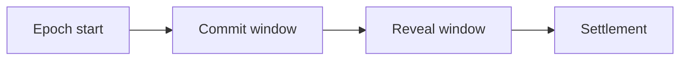

# Timing Windows (Spec)

This page defines how time is structured in TIMLG.

## Concepts

- **Epoch**: a bounded coordination window (e.g., daily, weekly, per-round).
- **Commit window**: period when commitments are accepted.
- **Reveal window**: period when reveals are accepted.

## Recommended MVP constraints

- Epoch length: fixed (config parameter)
- Commit window: first portion of epoch
- Reveal window: following portion of epoch
- Settlement: after reveal window closes

!!! warning
    Edge cases (late commits/reveals, clock drift, chain reorg behavior) must be addressed before production deployments.

## Edge cases to specify

- Late reveal: penalty or invalidation?
- Missing reveal: commitment expires?
- Multiple commits per author per epoch: allowed or restricted?
- Replays: how to prevent duplicate reveals?

## Next steps

- Choose epoch granularity for the MVP
- Define exact acceptance rules using on-chain timestamps/slots
