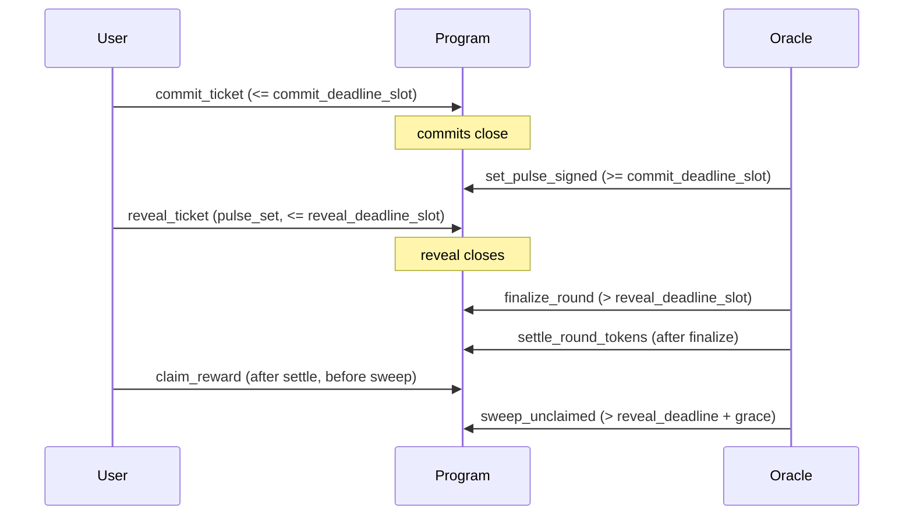

# Timing Windows (Spec)

TIMLG uses **slot-based windows** to enforce a commit→pulse→reveal flow.

## Round parameters

A round defines:

- `commit_deadline_slot` — last slot where commits are accepted (**inclusive** in MVP).
- `reveal_deadline_slot` — last slot where reveals are accepted (**inclusive** in MVP).
- `claim_grace_slots` — extra slots after `reveal_deadline_slot` before sweeping unclaimed SOL.

> Slot-based timing is deterministic and avoids wall-clock ambiguity.

---

## Window rules (MVP behavior)

### Commit window

- `commit_ticket` is valid if `current_slot <= commit_deadline_slot`
- Each `(round_id, user, nonce)` maps to a single ticket PDA; re-commit is rejected.

### Oracle pulse window

- The oracle can set the pulse only after commits close:
  - `current_slot >= commit_deadline_slot`
- Pulse is one-shot:
  - cannot be set twice
- A round cannot be finalized without a pulse.

### Reveal window

- `reveal_ticket` is valid if:
  - pulse is set, and
  - `current_slot <= reveal_deadline_slot`

### Finalization

- `finalize_round` is valid if:
  - pulse is set, and
  - `current_slot > reveal_deadline_slot`

### Claim + Sweep

- Winners can claim only after token settlement (see Settlement Rules).
- `sweep_unclaimed` is valid only after:
  - `current_slot > reveal_deadline_slot + claim_grace_slots`

---

## Timeline diagram

---

## Edge cases (handled by design)

- **Late pulse**: if pulse is never set, the round cannot finalize; governance/admin intervention may be required.
- **No reveal**: tickets that never reveal can be penalized (see Settlement Rules).
- **Idempotency**: settlement and sweep use guards so they are safe to call once and remain consistent.
