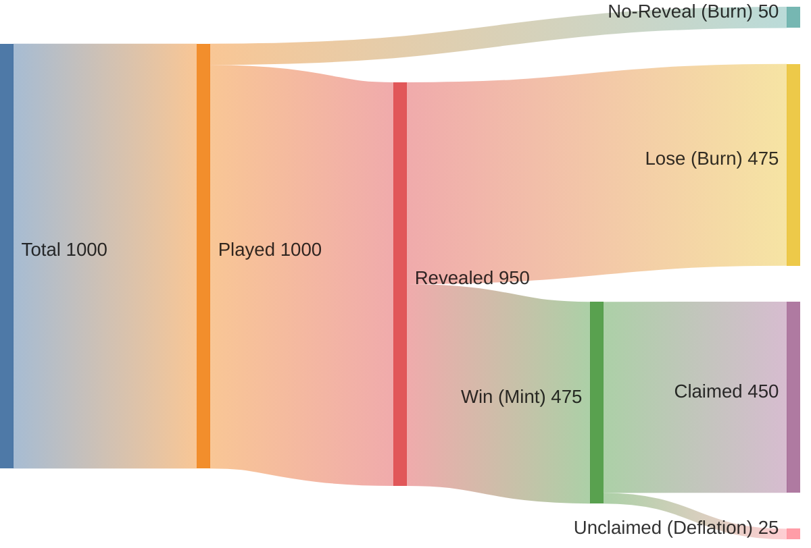

# Tokenomics (TIMLG)

This page documents **protocol economics** as implemented for the TIMLG MVP: what is staked, how rounds settle, and how
funds are routed.

It also includes a **token distribution** section, but marks it as **TBD** until the project formally defines supply,
allocations, and vesting.

!!! note "Scope"
    This page is about **protocol rules and incentives**, not an investment pitch.

---

## What exists today (MVP-aligned)

### Economic unit (base units)
- The protocol accounts in **base units** (`u64`).
- TIMLG uses **`decimals = 9`**, meaning **1 TIMLG = 1_000_000_000 base units**.
- This decimal configuration is consistent across all environments (Devnet and Mainnet).

!!! note "Implementation note"
    The on-chain program does not enforce mint decimals; `stake_amount` should be interpreted as **base units** of the configured mint.

### Why this exists
The economics are designed to:
1. Enforce **commit–reveal integrity** (discourage “commit then disappear”).
2. Keep settlement **deterministic** and auditable from on-chain state.
3. Support a **treasury** model for long-term sustainability (infra + future reviews).

---

## Outcomes and routing (MVP)

After the pulse is finalized and the reveal window closes, each ticket is classified:

| Outcome | Condition | Economic effect (MVP) |
|---|---|---|
| **WIN** | valid reveal and matches assigned target bit | user may **claim**: **refund stake** + **mint reward** |
| **LOSE** | valid reveal but does not match | stake is **burned** during token settlement |
| **NO-REVEAL** | no valid reveal by deadline | stake is **burned** during token settlement (same as LOSE) |

!!! warning "No promises"
    Rewards are protocol-defined accounting outcomes. They are not guarantees of profit, yield, or investment returns.

---

---

## Ticket rent (SOL) and “residue zero” cleanup

Each ticket is an on-chain account that holds a **rent-exempt lamport deposit**. This deposit is **not** part of the TIMLG reward.

- Winners claim **SPL tokens** via `claim_reward` (stake refund + minted reward).
- After settlement (and after claim if you won), the ticket owner should call **`close_ticket`** to close the ticket PDA and reclaim its lamports.

This keeps the system “residue zero” for users: token outcomes are auditable on-chain, and the network deposit is recoverable by the user.

## Claim + settlement model (what happens and when)

TIMLG separates “classification” from “distribution”:

1. **Commit:** stake escrowed into the **round token vault** (legacy code name: `timlg_vault`)
2. **Pulse:** oracle publishes the 512-bit pulse (Ed25519 verified)
3. **Reveal:** proof of commitment (guess + salt)
4. **Finalize:** round is locked
5. **Settle tokens:** losers and unrevealed are burned
6. **Claim:** winners can claim **refund + mint**
7. **Close ticket:** users close finished tickets to reclaim the ticket account’s SOL rent deposit (`close_ticket`)
8. **Sweep:** after a grace window, **round vault** native SOL and **remaining SPL tokens** are swept to their respective treasuries (tickets are not closed by sweep).

This separation makes the protocol easier to audit and harder to exploit with timing tricks.

---

## Anti-griefing design

The primary griefing pattern in commit–reveal systems is:

- users commit, then refuse to reveal (to influence outcomes or stall settlement)

TIMLG addresses this by:
- enforcing slot-bounded windows
- routing **NO-REVEAL** stake to be **burned** (prevents “free option to disappear”)
- burning **LOSE** stake (makes spam participation costly)

---

## Supply intuition (MVP)

Per ticket, the token supply changes like this:

- **WIN:** supply **+1,000,000,000** base units (reward is minted on claim)
- **LOSE:** supply **−1,000,000,000** base units (stake is burned during settlement)
- **NO-REVEAL:** supply **-1,000,000,000** base units (stake is burned during settlement)

If the experiment is truly unbiased for a single bit (p ≈ 0.5) and participants are not advantaged,
then in expectation:

- `E[Δsupply] ≈ +0.5 − 0.5 = 0` (ignoring NO-REVEAL)

### Token Flow Visualization (Expectation)

The following diagram shows the statistical flow of the TIMLG token per round.

!!! important "MVP nuance"
    The reward is minted **only when the winner claims**.
    If winners do not claim, fewer rewards are minted while loser burns still happen → the system becomes
    **net deflationary** relative to “all winners claim”.

---

## Fees (Implemented)

The system includes a configurable fee on rewards:
- `reward_fee_bps`: Basis points charged on the minted reward (0 = 0%).
- Fees are routed to a dedicated **Reward Fee Pool** (SPL TokenAccount).
- These parameters are initialized via `initialize_tokenomics` and stored in the `Tokenomics` account.

---

## Token distribution (TBD)

The project name/ticker has been updated to **TIMLG (TimeLog)**.

A full “launch tokenomics” plan is **not finalized yet**, including:
- total supply / emission schedule
- allocations (team, treasury, community, liquidity, advisors, etc.)
- vesting and unlock schedules
- exchange/liquidity strategy
- governance distribution (multisig / DAO transition)

Until defined, the public docs will only describe **protocol economics** (how the game settles and routes value), not a
market distribution plan.

!!! tip "Good public practice"
    When distribution is defined, publish it in a **versioned whitepaper release** (e.g., v0.2) and mirror a summarized
    version here.

---

## What is intentionally not published here

- private treasury operations / signer custody procedures
- relayer/oracle operational runbooks
- any detail that enables unauthorized authority changes or fund movement
