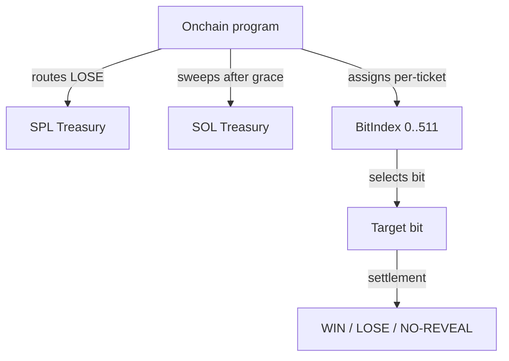

# Treasury & BitIndex

This page describes (1) TIMLG’s **treasury model** at a public, protocol-rule level and (2) the **BitIndex** concept used to assign tickets to bits of the 512-bit pulse.

It is written to be accurate without exposing sensitive operational details.

---

## Treasury principles

1. **Separation of duties**
   - Treasury custody should be distinct from upgrade authority and oracle signing keys.

2. **Public rules, private operations**
   - We publish *what happens* (routing rules and invariants), not the operational signer setup.

3. **Auditable routing**
   - Treasury flows should be reconstructable from on-chain transactions and state.

!!! warning "Never publish secrets"
    Do not publish private keys, seed phrases, privileged configs, or signer infrastructure.

---

## Treasury surfaces (MVP)

The MVP uses two treasury endpoints:

| Treasury | Asset | Purpose (public view) |
|---|---|---|
| **SPL Treasury** | protocol token | receives routed outcomes (e.g., LOSE stake) |
| **SOL Treasury** | lamports | receives post-grace sweeps of native SOL leftovers |

> The exact accounts are configured on-chain and should be treated as canonical by indexers.

---

## Routing rules (MVP-aligned)

At a high level:

- **LOSE** stake is routed to the **SPL treasury** during `settle_round_tokens`.
- **NO-REVEAL** stake is **slashed** to prevent griefing (MVP: burn).
- After a **claim grace period**, unclaimed leftovers are eligible for `sweep_unclaimed` to the relevant treasury path.

For timing and gating details, see:
- **Timing Windows**
- **Settlement Rules**

---

## BitIndex (concept)

### Why BitIndex exists

The pulse has **512 bits**. If many participants target the same bit, participation can cluster and degrade the experiment’s usefulness.

**BitIndex** is a deterministic assignment that maps each ticket to a bit position `0..511`, so participation distributes across the pulse.

### High-level definition

For each ticket:

- `bit_index = H(seed) mod 512`

Where:
- `H` is a standard hash (e.g., SHA-256)
- `seed` is constructed from **public, replay-resistant** values

### Publicly safe seed format

A robust public seed format is:

- `seed = "TIMLG:BITINDEX:v1" || round_pubkey || participant_pubkey || ticket_nonce`

This ensures:
- determinism (everyone computes the same)
- domain separation (future upgrades can move to v2)
- resistance to third-party malleability (seed depends on on-chain identities)

---

## BitIndex + settlement

Once assigned, the ticket is evaluated against:

- `target_bit = ExtractBit(pulse_512, bit_index)`

And the ticket’s revealed guess is compared to `target_bit` to classify WIN/LOSE/NO-REVEAL.

---

## Minimal control diagram (public)

---

## Hardening roadmap (public)

Before any mainnet-like readiness, treasury control should be hardened:

- multisig for SPL treasury authority
- multisig for program upgrade authority
- documented authority rotation policy (without exposing signer details)

Operational playbooks remain private by design.

---

## Public invariants

1. BitIndex is deterministic and reproducible from public inputs.
2. Routing rules (treasury/burn/sweep) are observable from transactions.
3. Sweep cannot occur before the configured grace window.
4. Public docs never include information sufficient to reconstruct privileged signers.
