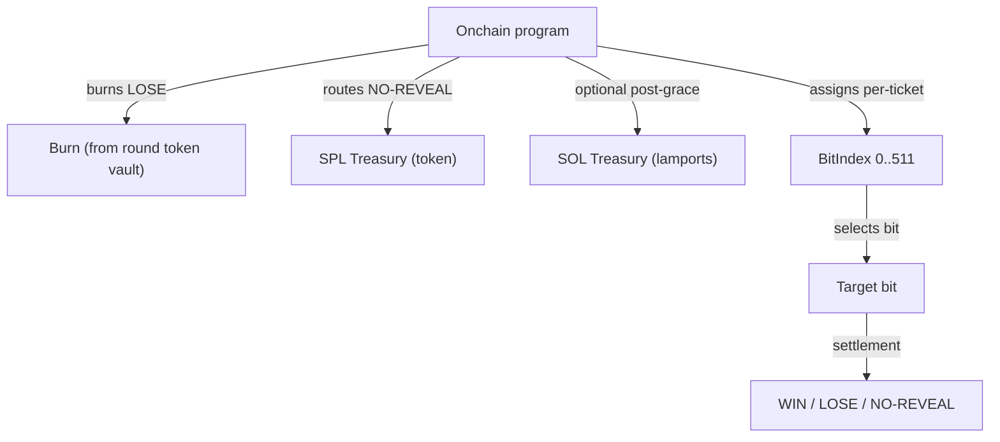

# Treasury & BitIndex

This page describes (1) TIMLG’s **treasury model** at a public, protocol-rule level and (2) the **BitIndex** mechanism
used to assign tickets to bits of the 512-bit pulse.

It is written to be accurate without exposing sensitive operational details.

---

## Treasury principles

1. **Separation of duties**
   - Treasury custody should be distinct from upgrade authority and oracle signing keys.

2. **Public rules, private operations**
   - We publish *what happens* (routing rules and invariants), not the operational signer setup.

3. **Auditable routing**
   - Treasury flows should be reconstructable from on-chain transactions and state.

!!! warning "Never publish secrets"
    Do not publish private keys, seed phrases, privileged configs, signer infrastructure, or internal endpoints.

---

## Treasury surfaces (MVP)

The MVP uses two treasury endpoints:

| Treasury | Asset | Purpose (public view) |
|---|---|---|
| **SPL Treasury** | TIMLG token (SPL) | receives **NO-REVEAL** stake during token settlement |
| **SOL Treasury** | lamports | receives optional **post-grace** sweeps of native SOL leftovers |

> The exact accounts are configured on-chain and should be treated as canonical by indexers.

---

## Routing rules (MVP-aligned)

At a high level:

- **LOSE** stake is **burned** during `settle_round_tokens` (burn occurs from the round token vault).
- **NO-REVEAL** stake is transferred to the **SPL treasury** during `settle_round_tokens` (no burn, no mint).
- **WIN** stake is refundable only when the winner claims; the **reward is minted on claim** (`claim_reward`).
- After a **claim grace period**, `sweep_unclaimed` may run to route **native SOL only** (lamports) to the **SOL treasury**.
  - In the MVP, this sweep marks the round as swept and **closes the claim window**.

For timing and gating details, see:
- **Timing Windows**
- **Settlement Rules**

---

## BitIndex (as implemented)

### Why BitIndex exists

The oracle pulse has **512 bits**. If many participants target the same bit, participation can cluster and degrade the
experiment’s usefulness.

**BitIndex** is a deterministic assignment that maps each ticket to a bit position `0..511`, so participation distributes
across the pulse.

### Exact definition (MVP v1)

For each ticket:

- `bit_index = u16_le( SHA256( "bitindex" || round_id_le || participant_pubkey || nonce_le )[0..2] ) mod 512`

Where:
- `round_id_le` is `round_id` as 8 bytes little-endian
- `nonce_le` is `nonce` as 8 bytes little-endian
- `participant_pubkey` is the raw 32-byte pubkey
- `SHA256` is computed over the concatenation of those byte slices
- `u16_le([b0,b1])` interprets the first two bytes as little-endian `u16`

!!! note "Versioning"
    This seed format is part of the public protocol surface. If it ever changes, it must be versioned (v2) and treated
    as a breaking change for indexers.

---

## BitIndex + target bit

Once assigned, the ticket is evaluated against:

- `target_bit = ExtractBit(pulse_512, bit_index)`

In the MVP extraction convention:

- `byte_i = bit_index / 8`
- `bit_i  = bit_index % 8`
- `target_bit = (pulse[byte_i] >> bit_i) & 1`

This means bit 0 is the **least significant bit of pulse[0]**, bit 7 is the MSB of pulse[0], bit 8 is the LSB of
pulse[1], etc.

---

## Minimal control diagram (public)

---

## Hardening roadmap (public)

Before any mainnet-like readiness, treasury control should be hardened:

- multisig for SPL treasury authority
- multisig for program upgrade authority
- documented authority rotation policy (without exposing signer details)

Operational playbooks remain private by design.

---

## Public invariants

1. BitIndex is deterministic and reproducible from public inputs.
2. Routing rules (burn/treasury) are observable from transactions.
3. Sweep cannot occur before the configured grace window.
4. Public docs never include information sufficient to reconstruct privileged signers.
