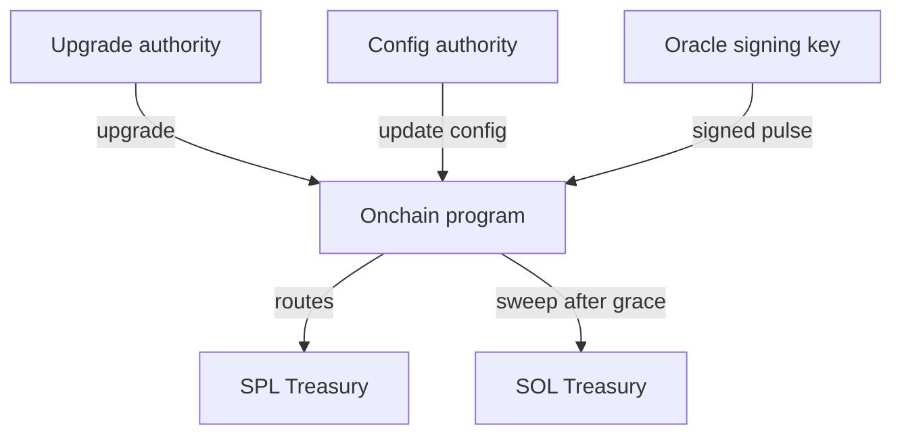

# Authority Surfaces

This page describes where “power” lives in TIMLG (MVP) and the public best practices for keeping it safe.

!!! warning "Public docs rule"
    We never publish keys, seed phrases, signer infrastructure, privileged configs, or operational runbooks.

---

## 1) Upgrade authority

- **Controls:** program upgrades (code changes)
- **If compromised:** full protocol takeover
- **Best practice:** multisig + hardware keys + tight access controls

## 2) Config authority

- **Controls:** protocol parameters (oracle pubkey, timing/grace parameters, safety toggles)
- **If compromised:** manipulate rounds, block users, change trust anchor
- **Best practice:** staged rollouts + separate from treasury and oracle keys

## 3) Treasury authority

- **Controls:** fund movement / treasury routing endpoints
- **If compromised:** direct loss of funds
- **Best practice:** multisig + separation of duties + transparent policy (high-level)

## 4) Oracle signing key

- **Controls:** which pulse becomes canonical (via `set_pulse_signed`)
- **If compromised:** outcome manipulation by signing arbitrary pulses
- **Best practice:** strict custody + rotation policy + hardened signer pipeline (private ops)

---

## Conceptual authority diagram

---

## Custody recommendations (public)

- Use **hardware wallets** where possible
- Separate roles:
  - upgrade authority ≠ config authority ≠ treasury authority ≠ oracle signing key
- Prefer **multisig** for upgrade + treasury once devnet is stable
- Never store secrets in repos (`.json` keypairs, `.env`, RPC keys)
