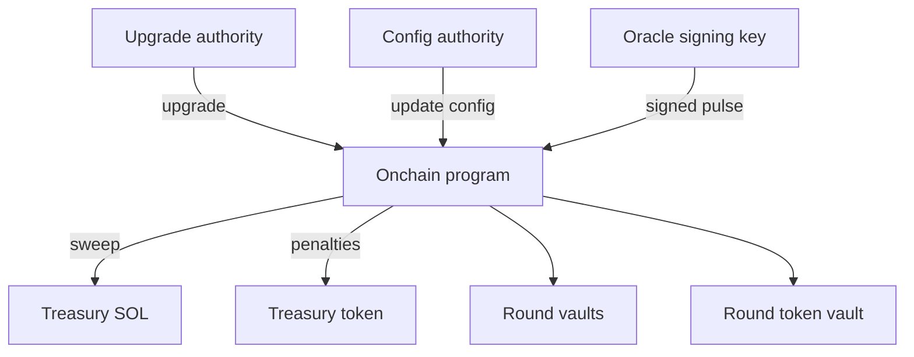

# Security & Control

This page explains what is intentionally **public vs private**, and how TIMLG is designed to preserve **authorized control** while avoiding accidental disclosure of sensitive operational details.

TIMLG is currently in an **MVP phase** (localnet validated). The implementation repository and operational tooling remain **private** until a stable devnet release is ready.

!!! warning "Principle"
    Public documentation must never include anything that enables unauthorized control, signing, authority changes, or fund movement.

---

## Security posture (MVP stage)

- **Goal today:** correctness + replay-safety + deterministic settlement + clear authority boundaries  
- **Goal next:** devnet parity, then hardening (multisig, separation of duties, audits)

This docs site is a **public artifact**. Anything posted here should be treated as public forever.

---

## Public vs Private (what we publish and what we don’t)

| Category | Public (this repo) | Private (not published here) |
|---|---|---|
| Specs & docs | Protocol overview, specs, diagrams, rationale | Internal design notes that expose attack paths |
| Roadmap & status | Milestones, progress snapshots | Private scheduling, vendor contacts, infra bills |
| Architecture | High-level component flow | Concrete infra topology (hosts, RPC endpoints, regions) |
| Keys & signers | **Never** | Private keys, seed phrases, signer JSON files, HW wallet setups |
| Oracle ops | High-level behavior | Oracle runbooks, automation, secrets, signing pipeline |
| Relayer ops | UX description | Relayer keys, batching infra, anti-spam heuristics |
| Treasury | Conceptual flows | Treasury signer details, authority handoff procedures |

!!! note "Docs-first, ops-private"
    The docs are meant to be transparent about the protocol’s *rules* without publishing the operational means to control or attack it.

---

## Control surfaces (where power lives)

TIMLG (MVP) has several control surfaces that require strict custody:

### 1) Upgrade authority (program upgrade)
- **What it controls:** program upgrades (code changes on-chain)
- **Risk if compromised:** full protocol takeover
- **Best practice:** multisig + hardware keys + strict access control  
- **Public docs rule:** never publish any information that helps locate or reconstruct upgrade signers.

### 2) Config authority (protocol parameters)
- **What it controls:** config updates, pause switches, oracle public key, grace parameters
- **Risk if compromised:** manipulate rounds, block users, change oracle trust anchor

### 3) Treasury authority (fund movement)
- **What it controls:** where SOL sweeps and penalty flows end up
- **Risk if compromised:** direct loss of funds

### 4) Oracle signing key (pulse publication)
- **What it controls:** which pulse becomes canonical for a round (via signed message)
- **Risk if compromised:** attacker can publish arbitrary pulses and influence outcomes

---

## Authority model (conceptual diagram)

---

## What the MVP already defends against (high level)

### Signed pulse verification (oracle)
- The program verifies an **Ed25519 signature** over a canonical pulse message.
- Pulse is **one-shot** per round (cannot be overwritten).
- This reduces “fake oracle” attacks and prevents casual pulse replacement.

### Replay resistance (signed / batch paths)
- Signed submission flows are designed to prevent:
  - reusing a signature to submit again (“replay”),
  - mixing users in ways that bypass authorization.

### Timing gates (slot-based)
- Slot-bounded commit/reveal windows enforce the commit–reveal discipline.
- Finalization and settlement are gated behind time windows and round flags.

---

## Threat model summary (MVP)

This is a short public summary; detailed operational analysis stays private.

| Threat | What it looks like | Potential impact | Mitigation (MVP / planned) |
|---|---|---|---|
| Key compromise (upgrade/config/treasury) | attacker gets a privileged key | takeover / fund loss | multisig + hardware keys + separation of duties (planned hardening) |
| Oracle key compromise | attacker signs pulses | outcome manipulation | strict key custody; rotation policy; eventually multisig oracle (future) |
| Pulse spoofing | submitting unsigned / wrong message | invalid pulse accepted | on-chain Ed25519 verification + canonical message |
| Replay attacks | reuse old signatures / tx patterns | double submit, bypass intent | guards + canonical payload + instruction verification |
| Griefing via no-reveal | users commit then refuse to reveal | stalls / unfairness | penalties for no-reveal (treasury flow), clear windows |
| DoS / spam | excessive ticket creation or tx spam | UX degradation | rate limiting via relayer (optional), fee economics, future anti-spam rules |
| Misconfiguration | wrong params, wrong oracle pubkey | broken rounds | config management discipline, staged rollouts, test scripts |

!!! tip "Good public rule"
    If a detail helps an attacker more than it helps a normal user, it belongs in private notes, not in public docs.

---

## Operational security recommendations (project-wide)

### Key custody
- Use **hardware wallets** where possible
- Separate keys by role:
  - upgrade authority ≠ treasury authority ≠ oracle signing key
- Prefer **multisig** for treasury and upgrades once devnet is stable

### Repo hygiene
- Never commit:
  - `.json` keypairs, seed phrases, `.env` secrets, RPC keys
- Use `.gitignore` and pre-commit checks to avoid accidental leaks

### Public comms
- Announce changes via:
  - roadmap + status updates
  - versioned whitepaper releases
- Avoid publishing “step-by-step operational runbooks” until you have hardened roles and key custody

---

## Responsible disclosure (security reporting)

If you believe you found a vulnerability:

1) **Do not** publish exploit details publicly.  
2) Open a GitHub issue **without sensitive details** and request a private channel, **or** use GitHub’s private security reporting if enabled for the organization/repo.

Please include:
- what component is affected (docs/spec/implementation if known)
- reproduction steps (minimal)
- expected impact
- suggested mitigation (if any)

We aim to acknowledge credible reports and coordinate a fix before public disclosure.

---

## What comes next (security hardening roadmap)

- Enable multisig for:
  - program upgrade authority
  - treasury authorities
- Oracle key rotation policy + optional threshold signing (future)
- External review / audit plan once devnet demo is stable
- Formalize invariants and adversarial tests for settlement paths