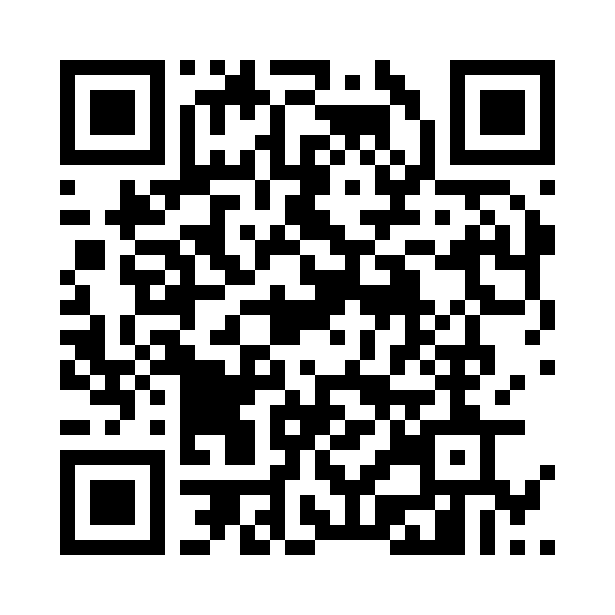

# Support

TIMLG Protocol is a research effort in active development. If you find the project valuable, you can support its infrastructure and engineering through an optional donation.

## Resource Allocation

A clear breakdown of how contributions empower the project's technical maturation.

| Area | Purpose | Priority |
|---|---|---|
| **Infrastructure** | Cloud nodes, RPC services & Firebase | [ HIGH ] |
| **Security** | Threat modeling & external audits | [ MED ] |
| **R&D** | Devnet iteration & protocol research | [ MED ] |

---

## Solana Development Fund

Contributions go directly toward maintaining the public Devnet environment and hardening the protocol.

**Verification Address:**  

  <a class="donation-address" href="https://explorer.solana.com/address/5a9iyBipjuQjQKziYTEayvu9aUwzxiZ4SuPWKbtCLAHL" target="_blank" rel="noopener noreferrer">5a9iyBipjuQjQKziYTEayvu9aUwzxiZ4SuPWKbtCLAHL</a>
  <button style="background:none; border:none; cursor:pointer; padding:4px; opacity:0.7;" onclick="timlgCopyDonationAddress()" title="Copy address">
    
      <svg xmlns="http://www.w3.org/2000/svg" viewBox="0 0 24 24"><path d="M19 21H8V7h11m0-2H8a2 2 0 0 0-2 2v14a2 2 0 0 0 2 2h11a2 2 0 0 0 2-2V7a2 2 0 0 0-2-2m-3-4H4a2 2 0 0 0-2 2v14h2V3h12V1z"/></svg>
    
  </button>

<small class="donation-hint">
*Note: This is an optional contribution to project infrastructure. No rights or securities are offered.*
</small>

---

## Technical contact

For critical bugs or integration research:

*   **Engineering**: [GitHub Issues](https://github.com/richarddmm/timlg-protocol/issues)
*   **Audit**: [Terminal Traceability](../audit.md)
*   **Integrity**: Never share private keys or seed phrases.
