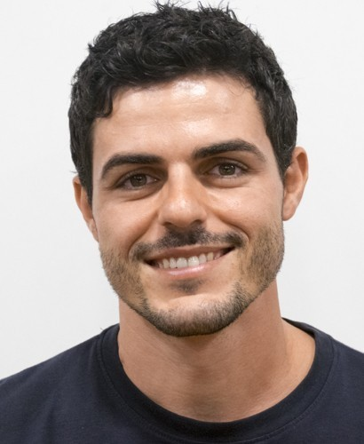

# Team & Contact

TIMLG is currently developed and maintained by a **single core contributor**.

## Richard David Martín

**Role:** Founder & Lead Developer (Solana / Anchor)

- **Location:** Canary Islands (Spain)
- **Background:** Big Data & AI, robotics and applied systems engineering
- **Focus:** verifiable coordination protocols, deterministic on-chain settlement, oracle design, and secure treasury control

-   **Email**

    [support@timlg.org](mailto:support@timlg.org)

-   **LinkedIn**

    [linkedin.com/in/richard-david](https://www.linkedin.com/in/richard-david-mart%C3%ADn-mart%C3%ADn-9845b474/)

